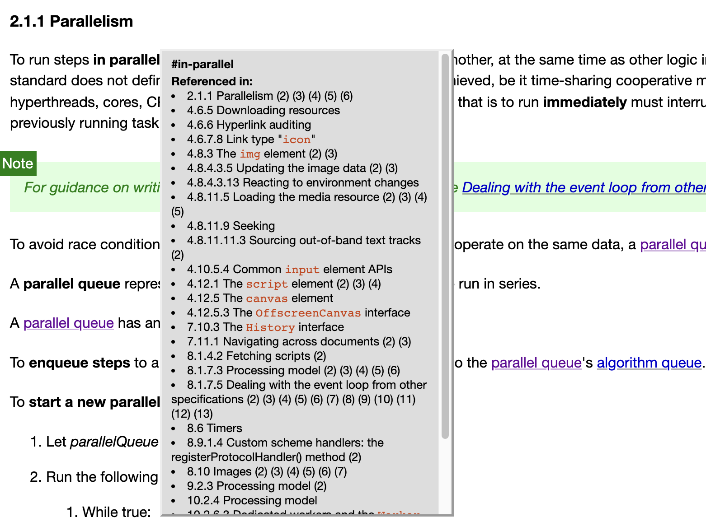

# 第二章总结：HTML的基础设施

 很多年前有人在[reddit上问马斯克](https://www.reddit.com/r/IAmA/comments/2rgsan/i_am_elon_musk_ceocto_of_a_rocket_company_ama/#t1_cnfre0a)，你为啥能学这么多东西？

马斯克回答说：

> it is important to view knowledge as sort of a semantic tree -- make sure you understand the
> fundamental principles, ie the trunk and big branches, before you get into the leaves/details or there is nothing for them to hang on to.
>
> 你需要把知识看作是一颗有语义的树 --- 确保在你钻研叶子/细节之前，理解基础的原理，即树干和大的枝干，否则你的知识没有“依靠“。

而HTML标准第二章就是整个标准的树干，也因此这个章节的名称为「Common infrastructure常见的基础设施」。比如：

- [2.3小节](https://html.spec.whatwg.org/#common-microsyntaxes)讲了HTML微语句的解析算法，这些微语句是HTML语句的基本组成部分之一。为了读懂这些规则，你需要了解标准书写算法使用的规范，为此我写了一篇文章：[以整数解析为例，如何读懂标准里的算法？](./2.3.md)；

- [2.5小节](https://html.spec.whatwg.org/#fetching-resources)讲了与资源获取相关的各种HTML属性，我选择了具有代表性的跨域属性，深入写了一篇文章：[crossorigin属性：为什么它是避免tainted canvases的关键？](./2.5.md)；
- [2.6小节](https://html.spec.whatwg.org/#collections)讲了几个常见的DOM接口，接口是什么其实不重要，重要的是如何读懂贯穿整个标准、用来描述接口的IDL片段，为此我写了一篇文章：[一文读懂web标准的基石：web IDL](./2.6.md)；
- [2.7小节](https://html.spec.whatwg.org/#safe-passing-of-structured-data)讲了「结构化克隆」，他是多个web api底层的运作机制。为此，我又写了一篇文章：[结构化克隆：浏览器的序列化机制](./2.7.md)。


<br/>


### 目录:

- [每节总结](#每节总结)

  * [2.1 Terminology 术语表](#21-terminology-术语表)

  * [2.2 Policy-controlled features](#22-policy-controlled-features)

  * [2.3 Common microsyntaxes 常见微语句](#23-common-microsyntaxes-常见微语句)

  * [2.4 URLs](#24-urls)

  * [2.5 Fetching resources 获取资源](#25-fetching-resources-获取资源)

  * [2.6 Common DOM interfaces 常见的DOM接口](#26-common-dom-interfaces-常见的dom接口)

  * [2.7 Safe passing of structured data 安全传输结构化数据](#27-safe-passing-of-structured-data-安全传输结构化数据)
<br/>


## 每节总结
<br/>


### 2.1 Terminology 术语表

这一小节主要是关于标准中用到的技术术语的定义。

一般来说，阅读术语表是一件很枯燥的事情。但是HTML标准里有一个交叉索引的功能，就是当你点击这个黑色加粗的术语的时候，他会显示标准中哪一些地方使用了这个术语（这也是为什么相比于纸质书，我更喜欢电子书的原因之一）：

<kbd></kbd>

比如在[2.1.1 Parallelism](https://html.spec.whatwg.org/#parallelism)，标准定义了一个`in parallel`的词组，`To run steps in parallel `表示这些步骤会与标准定义的其他逻辑（如`event loop`）并行执行 。与其相对应的是`run immediately ` ，表示该操作会中断当前执行的任务，等该操作完成后，才会恢复前面执行的任务。

如果你感到这么说有点抽象，这个时候，你就可以使用交叉索引来寻找标准中实际应用这个词组的地方。比如，用到`in parallel`的地方有：

> - [超链接的下载](https://html.spec.whatwg.org/#downloading-resources:in-parallel)
>
> - [默认获取"/favicon.ico"的icon文件](https://html.spec.whatwg.org/#rel-icon:in-parallel)
>
> - [`image.decode()`方法](https://html.spec.whatwg.org/#the-img-element:in-parallel)
>
> - [`media.fastSeek(time)`方法](https://html.spec.whatwg.org/#seeking:in-parallel)
>
> - [使用`input[type=file]`元素上传文件](https://html.spec.whatwg.org/#common-input-element-apis:in-parallel)
>
> - [script资源的获取](https://html.spec.whatwg.org/#the-script-element:in-parallel)
>
> - [`canvas.toBold()`方法](https://html.spec.whatwg.org/#the-canvas-element:in-parallel)
>
> - .....

有一定开发经验的你，至少会遇到过以上的一种或几种情况。比如，使用`input[type=file]`元素上传文件：

```js
<label for="avatar">Choose a profile picture:</label>
<input type="file"
       id="avatar" name="avatar"
       accept="image/png, image/jpeg">
```

从用户点击上传按钮、选择文件，到浏览器完成文件上传、派发` input`和`change`事件，这整个过程都不会打断主线程的运行。这么一想，你对`in parallel`就会有更加具体的感知。再配合其他的几个API一起理解，你就会知道这其实就是我们所熟知的**异步**执行的概念。

比如，对于这些异步执行的任务，一般有三种方式来获取执行的结果：

- callback：比如`canvas.toBold()`方法；
- 事件监听（严格说这也是callback）：比如`input[type=file]`；
- promise：比如`image.decode()`方法。

于是，就是这样，我们不断的从「枝干」去看「叶子」，又从「叶子」总结出「枝干」，反复递归，反复迭代，慢慢的，我们就能看到马斯克所说的「知识语义之树」的全貌。

本小节除了列出了一些HTML标准定义的术语，还有[依赖其他标准的术语](https://html.spec.whatwg.org/#dependencies)，这个列表非常非常的长，不大可能也没有必要一条一条地读完，在遇到的时候跟着链接去看定义就可以了。


<br/>


### 2.2 Policy-controlled features

这一小节非常简短，整节只有4行：

> This document defines the following [policy-controlled features](https://w3c.github.io/webappsec-feature-policy/#policy-controlled-feature):
>
> - "`autoplay`", which has a [default allowlist](https://w3c.github.io/webappsec-feature-policy/#default-allowlist) of `'self'`.
> - "`cross-origin-isolated`", which has a [default allowlist](https://w3c.github.io/webappsec-feature-policy/#default-allowlist) of `'self'`.
> - "`document-domain`", which has a [default allowlist](https://w3c.github.io/webappsec-feature-policy/#default-allowlist) of `*`.

如果你不知道有个东西叫[权限策略Permissions policy](https://w3c.github.io/webappsec-permissions-policy/#permissions-policy)（曾用名为「特征策略feature policy」），那你肯定不知道这里在说什么。这里的 `autoplay`可不是HTML多媒体元素的那个`autoplay`属性，而是一种控制页面内所有多媒体元素是否允许自动播放的全局策略。

这一部分我不打算在这里展开，我会在讲到iframe元素的时候再讲。权限策略与iframe的`allow`属性息息相关，有兴趣的可以先自行了解。


<br/>


### 2.3 Common microsyntaxes 常见微语句

这一小节主要讲了微语句的解析规则。关于如何理解这些解析规则，我在[《以整数解析为例，如何读懂标准里的算法？》](./2.3.md)里面做了详尽的阐述。

在这里，我为你总结了本节列出的所有的微语句以及他们的使用场景。

| 微语句类型                          | 描述                                                         | 应用场景例子                                                 |
| :---------------------------------- | ------------------------------------------------------------ | ------------------------------------------------------------ |
| 布尔属性                            | 出现表示true，不出现表示false                                | script元素的`async`、`defer`属性                             |
| 可枚举属性（enumerated attributes） | 属性有有限的状态：使用一组关键词/状态的映射集合，以及两个特殊状态`invalid value default`(非法值对应的状态)和一个`missing value default`(属性不出现时对应的状态)。 | 1. button元素的`type`属性的值有三种状态：`Submit Button`、`Reset Button`以及`Button`。 分别对应的关键词/属性值是：`submit` 、`reset`以及`button`。除此以外其他的值（即`invalid value default`）和以及该属性没出现的时候（即`missing value default`）对应的都是状态`Submit Button`。<br />2. 另一个例子是我在[另一篇文章](./2.5.md#总结)提到的crossorigin属性。 |
| 数字                                | 有整数、非负整数、浮点数、百分数、数字列表                   | progress元素的`value `和`max `的值都是浮点数。               |
| 日期与时间                          | 各种日期时间等格式                                           | 主要用在time元素上： 如`<time>2011-11-18T14:54Z</time>`      |
| 颜色                                | 格式例子：#000000                                            | `input[type=color]`的`value `属性上                          |
| 用空格隔开的tokens                  |                                                              | 所有元素都有的class属性                                      |
| 用逗号隔开的tokens                  | `  a ,b,,d d  `表示4个tokens，分别是"a"、"b"、空字符串和d    | `meta[name=keywords]`元素上的`content`属性：如`<meta name="keywords" content="british,type face,font,fonts,highway,highways">` |
| 索引                                | 哈希索引                                                     | img元素的`usemap`属性：如` ` |
| 媒体查询                            |                                                              | style元素的media属性                                         |


<br/>


### 2.4 URLs

这一小节篇幅不长，主要讲了URL的术语定义、解析规则、以及base URL对其他元素的影响。


<br/>


### 2.5 Fetching resources 获取资源

这一章讲了HTML资源获取方面的内容，内容比较繁杂，每一小节的内容可以总结如下：

- 2.5.1 定义了response的类型以及创建一个潜在的CORS请求的算法。
- 2.5.2 使用MIME type来决定资源的类型。
- 2.5.3 提取meta元素上声明的字符编码规则的算法。
- 2.5.4 CORS setting属性的讲解（对应元素的`crossorigin`属性），详见：[crossorigin属性：为什么它是避免tainted canvases的关键？](./2.5.md)
- 2.5.5 Referrer policy属性的讲解（对应元素的`referrerpolicy`属性）。
- 2.5.6 CSP对应的Nonce属性的讲解（对应元素的`nonce`属性 ）。
- 2.5.7 懒加载属性的讲解（对应元素的`loading`属性）。
- 2.5.8 Blocking 属性的讲解（对应元素的`blocking`属性）。

本节后面讲的属性中，CORS setting属性、Referrer policy属性、懒加载属性都属于[2.3小节](#23-common-microsyntaxes-常见微语句)中的所说的可枚举属性，Blocking属性的值则是用「用空格隔开的tokens」来表示。


<br/>


### 2.6 Common DOM interfaces 常见的DOM接口

本小节可以分成两个部分：

1. 第一部分讲的是**IDL属性(IDL attribute)** 对**内容属性(content attributes)** 的反映(reflecting)。

   内容属性一般指的是标签中出现的属性，比如下面的title属性就是内容属性：

   ```html
   <abbr id="myAbbr" title="Hypertext Transport Protocol">HTTP</abbr>
   ```

   IDL属性一般指在DOM对象中出现的属性，比如：

   ```js
   document.getElementById('myAbbr').title
   ```

   你会经常在标准里面看到类似[这样的话](https://html.spec.whatwg.org/#the-title-attribute:reflect)：

   > The `title` IDL attribute must [reflect](https://html.spec.whatwg.org/#reflect) the `title` content attribute.
   
   意思是DOM中的title属性必须反映标签中的title属性，可以表示为： 
   
   ```js
   document.getElementById('myAbbr').title === 'Hypertext Transport Protocol' // true
   ```
   
   当然，「反映」并不意味着所有情况下两个值都是完全相等，有很多的edge cases，这一节里就进行了详细的阐述。
2. 第二部分讲的是几个DOM接口：
    ```
    HTMLAllCollection
    HTMLFormControlCollection
    HTMLOptionsCollection
    DOMStringList
    ```
    对于这一部分，我没有详细讲解每一个接口是干什么的，我讲的是如何读懂这些接口。DOM标准、HTML标准、ECMAScript标准都是使用web IDL来描述接口的，显然，「让读者自己读懂web IDL」是一件比「为读者列举每个接口是干什么的」更加具有实际意义的事情。于是，我写了[《一文读懂web标准的基石：web IDL》](./2.6.md) ，给大家提供理解web IDL的基本框架。


<br/>


### 2.7 Safe passing of structured data 安全传输结构化数据

为了让js对象能够在不同的js realm中安全的传输，标准定义了一套对象的序列化和反序列化、以及在特定情况下转移对象的机制，称为结构化克隆。很多的web api都使用这样的一套机制，我在[结构化克隆：浏览器的序列化机制](./2.7.md)进行了深入的讲解。
