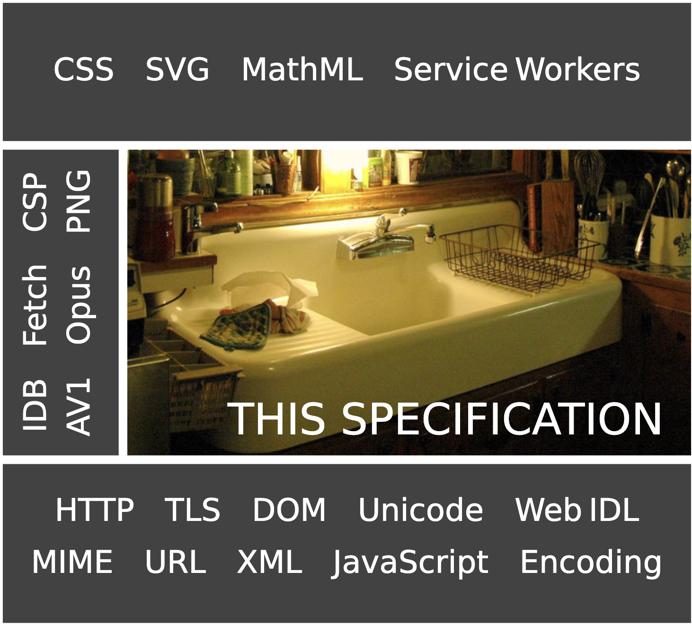

# 以整数解析为例，如何读懂标准里的算法？

在写`ol`元素的时候，我们可以添加一个名为`start`的属性，来表示有序列表的起始点：

```html
<ol start="3">
    <li>第三个</li>
    <li>第四个</li>
    <li>第五个</li>
</ol>
```

于是渲染出来的列表会从3开始，而不是从1开始：

```
3.第三个
4.第四个
5.第五个
```

这很好理解，但假如你给`start`属性赋予以下的值，又会有渲染出什么样的结果呢？

```html
<ol start=" 3 "></ol>
<ol start="-3"></ol>
<ol start="+3"></ol>
<ol start="- 3"></ol>
<ol start="'3'"></ol>
<ol start="three"></ol>
```

想要知道答案，笨方法是一个一个地在浏览器上去测试。之所以称之为笨方法，是因为得到的结论并不具有通用性：

- 比如，如果我又给出一个新的值，你还得重新去测试一次（别觉得这个值很离谱，它还真的被HTML当成3来用）：

  ```html
  <ol start="3sfhdsajfhaugwie"></ol>
  ```

- 如果我换一个属性，你还得重新测试一次。

从根本上解决这个问题的方法是：阅读并理解HTML标准里[关于整数的解析规则](https://html.spec.whatwg.org/#signed-integers) 。

<br/>


### 目录:
- [解析的基本模式](#解析的基本模式)
- [HTML对于整数的解析规则](#html对于整数的解析规则)
- [算法的规范](#算法的规范)
  * [1. 声明算法](#1-声明算法)
  * [2. 变量](#2-变量)
  * [3. 控制流](#3-控制流)
  * [4. 遍历](#4-遍历)
  * [5. 断言](#5-断言)
- [为何有的算法难以看得懂？](#为何有的算法难以看得懂)
  * [英语不行](#英语不行)
  * [概念不够](#概念不够)
- [一切都是可以积累的](#一切都是可以积累的)
<br/>


## 解析的基本模式

你可以把解析的过程看成一个函数，这个函数接收一个待解析的字符串`string`作为参数，然后从前往后依次读取`string`的每一个字符，根据定义的规则判断解析的结果。执行的过程中，函数内部有一个`position`变量，指向`string`当前被读取的字符。


<br/>


## HTML对于整数的解析规则

直接把标准给出的算法搬运过来，是这样子的：

> 1. Let input be the string being parsed.
>
> 2. Let position be a pointer into input, initially pointing at the start of the string.
>
> 3. Let sign have the value "positive".
>
> 4. [Skip ASCII whitespace](https://infra.spec.whatwg.org/#skip-ascii-whitespace) within input given position.
>
> 5. If position is past the end of input, return an error.
>
> 6. If the character indicated by position (the first character) is a U+002D HYPHEN-MINUS character (-):
>
>    1. Let sign be "negative".
>    2. Advance position to the next character.
>    3. If position is past the end of input, return an error.
>
>    Otherwise, if the character indicated by position (the first character) is a U+002B PLUS SIGN character (+):
>
>    1. Advance position to the next character. (The "`+`" is ignored, but it is not conforming.)
>    2. If position is past the end of input, return an error.
>
> 7. If the character indicated by position is not an [ASCII digit](https://infra.spec.whatwg.org/#ascii-digit), then return an error.
>
> 8. [Collect a sequence of code points](https://infra.spec.whatwg.org/#collect-a-sequence-of-code-points) that are [ASCII digits](https://infra.spec.whatwg.org/#ascii-digit) from input given position, and interpret the resulting sequence as a base-ten integer. Let value be that integer.
>
> 9. If sign is "positive", return value, otherwise return the result of subtracting value from zero.

把它意译过来的版本是这样的：

> 1. 令变量 *input* 为被解析的字符串。
>
> 2. 令变量 *position* 作为 *input* 的指针，初始的时候指向 *input* 的第一个字符。
>
> 3. 令变量 *sign* 的值为 "positive"。
>
> 4. [跳过](https://infra.spec.whatwg.org/#skip-ascii-whitespace) *input* 开头的 ASCII 空格，得到新的 *position*。
>
> 5. 如果此时 *position* 越过了 *input* 的末尾，返回一个错误。
>
> 6. 如果此时 *position* 指向的字符是一个 U+002D HYPHEN-MINUS 字符 （-）:
>
>    1. 令 *sign* 的值为 "negative"。
>    2. 将 *position* 前进到下一个字符。
>    3. 如果 *position* 越过了 *input* 的末尾，返回一个错误。
>
>    否则，如果此时 *position* 指向的字符是一个 U+002B PLUS SIGN 字符 （+）:
>
>    1. 将 *position* 前进到下一个字符。 （虽然 "`+`" 会被忽略但并不符合规范。）
>    2. 如果 *position* 越过了 input 的末尾，返回一个错误。
>
> 7. 如果此时 *position* 指向的字符不是 [ASCII 数字](https://infra.spec.whatwg.org/#ascii-digit)，则返回一个错误。
>
> 8. 从当前的 *position* 开始 [收集一个码点序列](https://infra.spec.whatwg.org/#collect-a-sequence-of-code-points) ，序列中每一个码点必须是[ASCII 数字](https://infra.spec.whatwg.org/#ascii-digit) ，将得到的序列解析为以10为底数的整数。 令 变量 *value* 为该整数。
>
> 9. 如果 *sign* 为 "positive"，返回 *value*，否则返回0减去 *value* 的结果。

就像我们前面说的，可以把解析的过程看成一个函数。于是，我们可以把每一句话“翻译”成js代码：

```js
function parseInteger(strToBeParsed){
    // 1. 令变量 input 为被解析的字符串。
    const input = strToBeParsed
    // 2. 令变量 position 作为 input 的指针，初始的时候指向 input 的第一个字符。
    let position = 0
    // 3. 令变量 sign 的值为 "positive"。
    let sign = "positive"
    // 4. input 开头的 ASCII空格，得到新的 position
    	// 根据引用，ASCII空格的码点为 U+0009 TAB, U+000A LF, U+000C FF, U+000D CR,  U+0020 SPACE.
    const ASCIIwhitespaceCodePoint = [0x0009, 0x000A, 0x000C, 0x000D, 0x0020] 
    while(ASCIIwhitespaceCodePoint.includes(input.charCodeAt(position))) position++
    // 5. 如果此时 position 越过了 input 的末尾，返回一个错误
    if (position >= strToBeParsed.length) throw 'Error at step 5'
    // 6. 如果此时 position 指向的字符是一个 U+002D HYPHEN-MINUS 字符 （-）:
    if (input.charCodeAt(position) === 0x002D ) {
        // 1. 令 sign 的值为 "negative"。
        sign = 'negative'
        // 2. 将 position 前进到下一个字符。
        position++
        // 3. 如果 position 越过了 input 的末尾，返回一个错误。
        if (position >= strToBeParsed.length) throw 'Error at step 6'
    	// 否则，如果此时 position 指向的字符是一个 U+002B PLUS SIGN 字符 （+）
    } else if (input.charCodeAt(position) === 0x002B) {
        // 1. 将 position 前进到下一个字符。 （虽然 "`+`" 会被忽略但并不符合规范。）
        position++
        // 2. 如果 position 越过了 input 的末尾，返回一个错误。
        if (position >= strToBeParsed.length) throw 'Error at step 6'
    }
    // 7. 如果此时 position 指向的字符不是ASCII数字，则返回一个错误。
    	// 根据引用，ASCII数字的码点范围为 U+0030 (0) to U+0039 (9)。
    if (input.charCodeAt(position) < 0x0030 || input.charCodeAt(position) > 0x0039) throw 'Error at step 7'
    // 8. 从当前的 position 开始收集一个码点序列，序列中每一个码点必须是ASCII数字，将得到的序列解析为以10为底数的整数。 令变量 value 为该整数。
    let sequence = ""
    while (input.charCodeAt(position) >= 0x0030 && input.charCodeAt(position) <= 0x0039) {
        sequence += input[position]
        position ++
    }
    const value = parseInt(sequence, 10)
    // 9. 如果 sign 为 "positive"，返回 value，否则返回0减去 value 的结果。
    if (sign === 'positive') {
        return value
    } else {
        return 0 - value
    }
}   
```

通过执行这个自己写的`parseInteger`函数，我们就可以知道开篇那个问题的答案了：

```js
console.log(parseInteger("3"))      // 结果为3
console.log(parseInteger(" 3 "))    // 结果为3
console.log(parseInteger("-3"))     // 结果为-3
console.log(parseInteger("+3"))     // 结果为3
console.log(parseInteger("- 3"))    // 报错：Error at step 7
console.log(parseInteger("'3'"))    // 报错：Error at step 7
console.log(parseInteger("three"))  // 报错：Error at step 7
console.log(parseInteger("3sfhdsajfhaugwie")) // 结果为3
```

当然了，即便你给`start`属性赋予"three"这个值，HTML也不会报错，而是回退到默认值`1`。这是因为标准对于解析的错误做了一层[封装](https://html.spec.whatwg.org/#the-ol-element:valid-integer)：

> An `ol` element has a starting value, which is an integer determined as follows:
>
> 1. If the `ol` element has a `start` attribute, then:
>    1. Let parsed be the result of [parsing the value of the attribute as an integer](https://html.spec.whatwg.org/#rules-for-parsing-integers).
>    2. If parsed is not an error, then return parsed.
> 2. If the `ol` element has a `reversed` attribute, then return the number of [owned `li` elements](https://html.spec.whatwg.org/#list-owner).
> 3. **Return 1.**


<br/>


## 算法的规范

通过上面的例子，你对标准中的算法应该也有一个大致的认识了。而标准之所以为标准，是因为它的各个方面都足够严谨。**所以，标准应该如何书写算法，也是有[相应的规范](https://infra.spec.whatwg.org/#algorithms)的。** 不仅仅是HTML标准，所有的web标准在书写算法步骤的时候，都遵循这个规范。所幸的是，整个算法规范的篇幅并不算长，而且很多地方都是符合直觉的，大框架基本可以总结如下：
<br/>


### 1. 声明算法

声明一个算法，表达的格式是这样的：

> To **[algorithm name]**, given a [type1] *[parameter1]*, a [type2] *[parameter2]*, …, perform the following steps. They return a [return type].

这里有三个重要的部分：

- **算法名称[algorithm name]**
- *参数[parameter]* 及其类型[type]
- 返回值的类型[return type]

在所有算法的声明中，这3个部分不仅出现的先后顺序一样，文本格式也是不变的（名称都会加粗，参数都是斜体）。除了算法名称以外，其他两个都不是必须的。

举个例子：以下是[判断元素是否懒加载](https://html.spec.whatwg.org/#will-lazy-load-element-steps)的算法：

> The **will lazy load element steps**, given an element *element*, are as follows:
>
> 1. ... return false.
> 2. ... return true
> 3. Return false

这个算法的名称为**will lazy load element steps**，接受一个类型为element的*element*参数。这里的返回类型没有在声明语句中表明，而是在具体步骤中表示出来。
<br/>


### 2. 变量

声明一个变量使用`let`，修改一个变量使用`set`。

> 1. <u>Let</u> *value* be null. 
> 2. If *input* is a string, then <u>set</u> *value* to input.
<br/>


### 3. 控制流

返回使用`return`，抛出错误使用`throw`。
<br/>


### 4. 遍历

`For Each`：对于list或map中的每一个item执行特定的步骤。

`While`：当条件满足的时候执行特定的步骤。如:

>
> While condition is "met":
>
> 1. …
<br/>


### 5. 断言

使用`Assert`。`Assert`表明后面的句子必须为真：

> 1. Let x be "`Aperture Science`".
>
> 2. [Assert](https://infra.spec.whatwg.org/#assert): x is "`Aperture Science`".


<br/>


## 为何有的算法难以看得懂？

像javaScript这种高级程序语言，它既被要求能够在只认识0和1的计算机上跑起来，又要保证对于人类一定的可读性。而标准里的算法完全是写给人看的，不需要兼顾计算机，用的都是人话。从这个角度上看，相比于读代码，读标准里的算法实际上应该更轻松才对。

但有时候我们觉得这些算法难以读懂，我认为可以总结为两点原因：

1. 英语不行
2. 概念不够（核心原因）
   
<br/>


### 英语不行

尽管HTML标准也有[中文版](https://whatwg-cn.github.io/html/)，但我极度不建议大家依赖中文版。

一方面，中文版的翻译有很多过时的内容。就像我在[HTML标准第一章解读](1.6&1.8.md)说到的一样，现在HTML标准是living standard，内容是动态更新的，上一次的更新就在今年的10月7日，距离发表这篇文章时的几天前。而中文版的翻译完全跟不上这个更新速度，我在中文版中随便搜了一下，目前有235处标记了「本小节的翻译已过时」。

另一方面，HTML标准是需要和很多其他的web标准一起配合阅读的，就像[标准第一章](https://html.spec.whatwg.org/#abstract)所给出的那张标准之间的关系图一样：

<kbd></kbd>

在阅读的过程中，你点的链接时不时就会跳到其他的标准里，而大多数的这些标准是没有中文翻译的。

更重要的是，依赖中文版会让你永远无法获得专业级别的英文文档阅读能力。HTML标准里的每一个词汇的使用、每一个句子的表达都是经过W3C和WHATWG委员会仔细推敲、反复修订、严格审核而成的，用的都是世界上最地道的计算机英语。你越是依赖中文资料，你对英文文档就越恐惧，于是英文水平就越可能成为你技术进步的巨大阻碍。

所以，我的建议，包括我自己也是这么做的：**只读英文版的标准，在阅读过程中遇到的所有问题，也只用英文进行检索。** 这就好比如果你要通过举哑铃锻炼肱二头肌，你需要刻意避免在举哑铃的过程中使用到腰部的力量，这样才能最大程度地刺激肱二头肌。为了打磨英文文档阅读的能力，你就应该刻意限制自己的中文使用。


<br/>


### 概念不够

然而，相比于英语不行，概念不够才是更加核心的原因。

举个例子，在本文所举的整数解析的算法例子中，如果你的脑子里面没有「字符集」、「字符编码」的概念，那么你很难清晰地理解算法里所说的「U+002D 字符」是什么东西，「code point/码点」又是什么东西。相反的，如果你不但理解「字符集」、「字符编码」，你还知道有个东西叫「状态机」，那么这段算法对你来说简直就像白开水一样。

另一个例子是[HTML标准2.2 小节](https://html.spec.whatwg.org/#policy-controlled-features)，这一小节只有短短的4行：

> This document defines the following [policy-controlled features](https://w3c.github.io/webappsec-feature-policy/#policy-controlled-feature):
>
> - "`autoplay`", which has a [default allowlist](https://w3c.github.io/webappsec-feature-policy/#default-allowlist) of `'self'`.
> - "`cross-origin-isolated`", which has a [default allowlist](https://w3c.github.io/webappsec-feature-policy/#default-allowlist) of `'self'`.
> - "`document-domain`", which has a [default allowlist](https://w3c.github.io/webappsec-feature-policy/#default-allowlist) of `*`.

虽然只有短短的四行，英文也非常简单。但如果你的脑子里面没有「Permission Policy」或者「Feature Policy」的概念，你不可能知道这是在讲什么东西。

**在阅读标准的过程中，你会遇到大量前置引用的情况。** 比如一个在第八章才给予正式定义的概念，在第二章的时候就拿出来用了。也有很大一部分的概念是在其他的web标准中定义的，你需要跳到其他的标准才能看到这个概念的完整解释。**而当你的脑子里缺乏必要的概念的时候，往往就很难正确理解一个句子。**

我在阅读标准的过程中也常常遇到读不懂的地方，遇到这种情况，我的「算法」一般是这样的：

1. 反复多次阅读。

2. 刻意寻找句子中那些不明白意思的词组，这些词组往往对应着一个关键的概念，也是理解整个句子的关键。

   > 这里需要注意的是，有时候有的词组/概念你经常看到，以至于你以为你知道这是什么意思，但可能实际上并不是这样的。衡量的标准是：你能否用自己的话清晰地表达出这个词组/概念是什么意思。

3. 对于这些不理解的词组：如果有索引，就跳到他的索引上去看。HTML标准的交叉索引做得非常好，通过索引你常常能看到这个词组的定义，或者这个词组的多个不同的应用场景，我在[第二章总结](./2.0.md#21-terminology-术语表)中给大家举了一个例子。

4. 如果没有索引，或者看了索引的资料也看不懂，就去谷歌，使用MDN等辅助材料来帮助理解。

5. 如果以上的步骤都做完了还是无法理解，可能说明这个句子有一些隐藏得更深的关键概念，是我现在的知识网络中没有的。于是我会先跳过这部分，往后读。我经常会发现，当我过一段时间后再回来读，会拍自己大腿：这么简单的东西我当初咋看不懂呢？


<br/>


## 一切都是可以积累的

不管你的现状是怎么样，一切都是可以积累的。英语不行，可以通过大量阅读英文文档来提升英文能力。概念不够，可以通过大量的刻意积累来编织健壮的知识网络。强如尤雨溪，也不是一生出来就会写js的。所以不必低估自己，觉得自己读不懂标准。只要不断改进、不断积累，保持耐心，每个人都是可以变得越来越好的。

