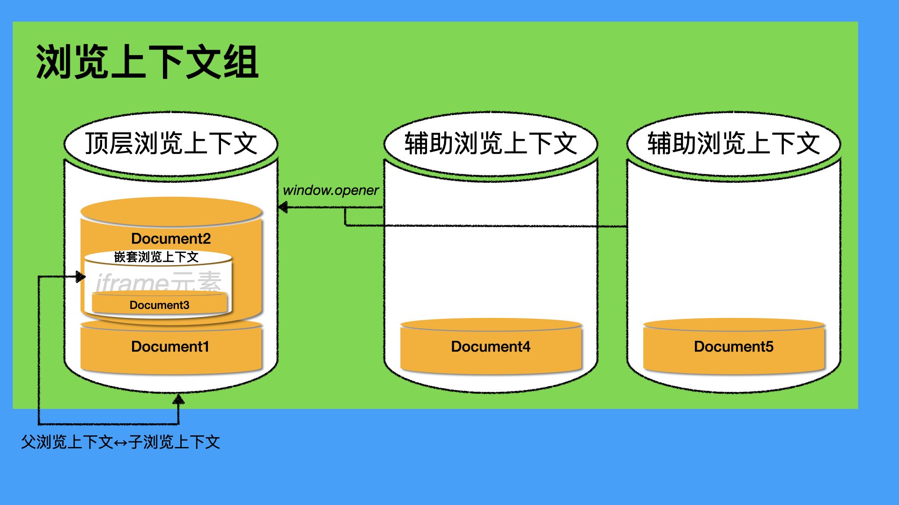

# 你不知道的document对象(上)：document与浏览上下文

> HTML最近对浏览上下文的概念进行了[重构](https://github.com/whatwg/html/commit/0a97a81da77bc4cb0ab5b16420605ca001ff5b17)，多出了一个"navigable" 和 "traversable navigable"的概念，本文在近期也会对这次重构进行相应的修正。

所有的前端工程师都认识document对象，所有的HTML文档都有一个document对象，几乎所有的HTML教材都会把document对象列为重点讲解的内容。然而，就是这样一个我们在开发当中几乎天天用到的“明星”对象，我们真的对它了如指掌吗？你可以用下面几个问题来测试一下自己：

> 1. 通过HTML文档创建一个新的document对象的方式有哪些？
> 2. document对象与浏览上下文的关系是什么？document对象如何选择浏览上下文？
> 3. document对象的创建和初始化的过程是怎么样的？
> 4. 对于不同类型的资源（如HTML、图片、PDF），生成的document对象有什么不同？
> 5. document对象关联了哪些安全策略/特性？
> 6. document对象有将近300个属性方法，你能对这些属性方法做一个有意义的分类吗？
>

这些问题，绝对不是那种故意刁难读者而设置的问题，如果为了那样做，我完全可以问一下非常细枝末节的问题，比如：

- 在什么情况下，document对象的源（可用`self.origin`访问）会与document URL的源（`document.URL`）不一样？

而我上面列出的问题，都是非常宏观，可以作为你知识体系中的“树干”的问题。对于这些问题，如果你没认真读过HTML标准，在其他的二手资料中是很难找到答案的。在这里，我将会基于HTML标准的[3.1小节 Document](https://html.spec.whatwg.org/#documents)、[第7章 页面加载](https://html.spec.whatwg.org/#browsers)、以及其他web标准零零碎碎的地方，用三篇文章，准确地、清晰地、系统地给大家深度讲解document对象：

- 你不知道的document对象(上): document与浏览上下文，即本文；
- [你不知道的document对象(中): document对象的初始化会经历哪些过程？](./3.1.2.md)
- [你不知道的document对象(下): web标准是如何组装document对象的？](./3.1.3.md)


<br/>


### 目录:

- [为什么要理解document对象与浏览上下文的关系？](#为什么要理解document对象与浏览上下文的关系)

- [document对象是什么？](#document对象是什么)

- [什么是浏览上下文？](#什么是浏览上下文)

- [document对象与浏览上下文](#document对象与浏览上下文)

  * [通过HTML文档创建一个新的document对象的方式有哪些？](#通过html文档创建一个新的document对象的方式有哪些)

  * [指定浏览上下文：浏览上下文名称或关键词](#指定浏览上下文浏览上下文名称或关键词)

  * [与「辅助浏览上下文」相关的安全特性：noopener与COOP](#与辅助浏览上下文相关的安全特性noopener与coop)

  * [与「嵌套浏览上下文」相关的安全特性：sandbox flag](#与嵌套浏览上下文相关的安全特性sandbox-flag)

- [总结](#总结)
<br/>


## 为什么要理解document对象与浏览上下文的关系？

绝大多数的document在创建之前，都会先找到其所归属的浏览上下文，理解他们的关系，有助于你：

- 必要的时候，精准控制document对象插入哪一个浏览上下文，如正确地理解并使用超链接元素上的`target`属性。
- 正确地理解并使用浏览器赋予的安全特性，包括COOP策略、`noopener`等等。
- 选择浏览上下文是document对象初始化的第一步，理解这一步有助于理解完整的创建与初始化过程，也就是[下一篇文章](./3.1.2.md)的内容。

除此以外，document对象上的一些属性方法的行为也与浏览上下文息息相关。比如，对于上面所提到的那个细枝末节的问题，标准是给了[答案](https://html.spec.whatwg.org/#documents:document-7)的：

> 在什么情况下，document对象的源会与document URL的源不一样？
>
> > A Document's origin may differ from the origin of its URL; for example when a nested browsing context is created, its active Document's origin is set to the nested browsing context's container document's origin, even though its active Document's URL is about:blank.
>>
> > 一个document的源可能和它的URL的源不一样；举个例子，当一个嵌套浏览上下文被创建的时候，它的活跃document的源，会设置为其嵌套浏览上下文容器的document的源，即便他的活跃document的URL是about:blank。

如果你不知道浏览上下文与document之间的关系，那大概率你看到这段话的时候也是一张黑人问号脸。


<br/>


## document对象是什么？

从不同的视角看，document对象有不同的含义。

从DOM的角度看：document对象是一个node节点，节点类型为`DOCUMENT_NODE`，是9种node节点的一种。

从HTML的角度看：document对象是HTML文档的代表物。[标准](https://html.spec.whatwg.org/#documents)的原话是这样的：

> Every XML and HTML document in an HTML UA is represented by a `Document` object. 
>
> 在*HTML用户代理（User Agent，如浏览器）*中的每一个XML和HTML文档都由`Document`对象表示。

本文，我们的document对象主要是指在HTML视角中的含义。


<br/>


## 什么是浏览上下文？

依据标准的[定义](https://html.spec.whatwg.org/#browsing-context)：

> A browsing context is an environment in which `Document` objects are presented to the user.
>
> 浏览上下文是一个包含一个或以上document对象的环境。

一般来说，打开一个浏览器标签、给HTML文档插入iframe元素都会创建一个新的浏览上下文。每个浏览上下文都会关联一个对应的*会话历史记录（session history）*，列出所有已经被展示、正在被展示又或者将要被展示的document对象。 这个会话历史记录可用我们熟知的[History对象](https://developer.mozilla.org/en-US/docs/Web/API/History)访问，如下图所示：


每一个浏览上下文都必定包含至少一个document对象。即便你创建一个空标签，它也会自动创建一个URL为`about:blank`的document对象，并且自动给这个document对象添加一个html元素，以及两个空的子元素：一个head元素、一个body元素。所以这个document的HTML是这样的：

```html
<html>
  <head></head>
  <body></body>
</html>
```

不过，使用浏览器标签创建的浏览上下文和iframe元素创建的浏览上下文是不一样的，前者创建的叫**顶层浏览上下文**，后者创建的叫**嵌套浏览上下文**。而不同类型的浏览上下文，他们的行为上会有差异，受到的安全限制也可能不同。根据浏览上下文之间的关系，可以把浏览上下文按照以下方式进行分类：

| 类型                                             | 解释                                                         | 例子                                                         | 关键词        |
| ------------------------------------------------ | ------------------------------------------------------------ | ------------------------------------------------------------ | ------------- |
| 顶层浏览上下文(top-level bc)                     | 没有父浏览上下文的浏览上下文                                 | 一个新建的浏览器标签                                         | `_top`        |
| 嵌套浏览上下文(nested bc)                        | 有的HTML元素(如iframe、embed、object)可以实例化一个浏览上下文，这种元素称为**浏览上下文容器(bc container)** ，容器内的浏览上下文称为嵌套浏览上下文。 | iframe元素创建的浏览上下文                                   |               |
| 父浏览上下文(parent bc) / 子浏览上下文(child bc) | 嵌套浏览上下文的容器所处的document对应的浏览上下文，与该嵌套浏览上下文就是父子关系。 | 父：一个document所在的浏览上下文；<br />子：这个document中的iframe元素所创建的浏览上下文。 | 父：`_parent` |
| 辅助浏览上下文(auxiliary bc)                     | 辅助浏览上下文也是顶层浏览上下文，它关联着另一个顶层浏览上下文，并与这个浏览上下文位于同一个「浏览上下文组」中。 | document1使用`window.open(URL)`打开document2，document2所处的浏览上下文就是一个辅助浏览上下文，document2可以通过`window.opener`连接document1 | `_blank`      |

使用图例展示他们的关系就一目了然了：




<br/>


## document对象与浏览上下文
<br/>


### 通过HTML文档创建一个新的document对象的方式有哪些？

大致有这么几种：

- 插入可作为浏览上下文容器的元素，如iframe元素；
- 通过超链接导航，如a、area元素创建的超链接；
- 使用form元素提交表单；
- 使用document对象或其构造器：`new Document()`、`document.implementation.createDocument()`、`document.open(url, target,feature)`。
- 使用宿主对象API，如`window.open()`、Location相关导航方法`location.assigin()`、`location.reload()`、`location.replace()`；

在这里，有的方式创建的document确定地会创建并使用新的浏览上下文，比如使用iframe元素；有的方式创建的document确定地会进入当前文档的浏览上下文，如Location相关的导航方法；还有的方法创建的document不会进入任何浏览上下文，如`document.implementation.createDocument()`、`new Document`。

而其他的方式，会有默认选择的浏览上下文，但是你也可以通过**浏览上下文名称或关键词**显式指定特定的浏览上下文。


<br/>


### 指定浏览上下文：浏览上下文名称或关键词

对于那些可以指定浏览上下文的创建document对象的方式，我们可以通过**浏览上下文名称或关键词**来指定特定的浏览上下文：

> - 如果没有指代任何值，则使用默认的浏览上下文。
> - 如果指代的值`target`匹配任何以下的关键词：
>   - `_self`：选择当前document的浏览上下文；
>   - `_top`：选择当前浏览上下文对应的顶层浏览上下文，如果没有的话就使用`_self`；
>   - `_parent`：选择当前浏览上下文对应的父浏览上下文，如果没有的话就使用`_self`；
>   - `_blank`：新建一个顶层浏览上下文，选择这个浏览上下文；
> - 如果没有匹配任何关键词，表明`target`可能指代的是一个自定义名称的浏览上下文：
>   - 查看当前浏览上下文关联的其他浏览上下文中，是否有相同名称的浏览上下文，如果有的话，选择这个浏览上下文；
>   - 如果没有的话，创建一个新的浏览上下文，把这个浏览上下文命名为`target`，并选择这个浏览上下文。

而不同的API对于浏览上下文名称的声明方式，我也用一张表给你总结了：

| API                                  | 浏览上下文名称声明方式                                       |
| ------------------------------------ | ------------------------------------------------------------ |
| 超链接元素：`a`、`area`              | 使用`target`属性声明，默认是`_self`。                        |
| 表单元素：`form`                     | 使用`target`属性声明，默认是`_self`。`form`元素内不同的提交按钮可以使用`formtarget`属性覆盖`form`元素上的`target`属性。 |
| `base`元素                           | 使用`target`属性声明，会作为页面内所有超链接以及表单提交的默认值。 |
| `window.open(url, target, feature)`  | 使用`target`参数声明，默认是`_blank`。                       |
| `document.open(url, target,feature)` | `document.open()`的行为比较奇怪，当使用2个或以下的参数，会使得当前document进入写入模式；当使用3个参数，表现与`window.open()`一致。 |

而给浏览上下文命名的方式有这么两种：

1. 使用iframe、object元素上的`name`属性，这些元素所创建的嵌套浏览上下文会以`name`属性的值命名；
2. 使用`window.open(url, target)`，当`target`不匹配任何现有的浏览上下文名称，就会创建一个以`target`为名字的浏览上下文。

基于以上，如果我想在页面中点开一个超链接，但要求这个链接在iframe中打开，只要这么设置就可以了：

```html
<iframe name="my-bc-name"></iframe> 
<a href="http://localhost:8080/iframe.html" target="my-bc-name">麻烦在iframe中打开</a>
```


<br/>


### 与「辅助浏览上下文」相关的安全特性：noopener与COOP

前面提到过，当通过`_blank`打开新的页面的时候，会创建一个新的浏览上下文，这个浏览上下与当前的document所处的浏览上下文位于同一个「浏览上下文组」，新的浏览上下文也称为「辅助浏览上下文」，并且可以通过`window.opener`连接到打开它的浏览上下文。当然，不用我说你也知道这是存在一定安全风险的。

有两个办法可以规避这个风险：

- 使用noopener/noreferrer
- 使用[COOP策略](https://html.spec.whatwg.org/#cross-origin-opener-policies)

noopener/noreferrer通过强制让辅助浏览上下文进入新的浏览上下文组，切断了这层连接，使得`window.opener === null`。

你可以使用以下方式声明这个安全特性：

- `window.open(url,target,feature)`：使用feature参数进行声明，值可以是`noopener`或`noreferrer`。
- form、a、area元素通过`rel`属性来进行声明，值可以是`noopener`或`noreferrer`。

noreferrer除了跟noopener做一样的事情以外，还避免泄露相关的referrer信息。

而COOP策略，全名Cross-Origin-Opener-Policy，跨源程序打开策略，做的事情其实是跟noopener也是一样的，只不过他是做的是一种全局的设置。


<br/>


### 与「嵌套浏览上下文」相关的安全特性：sandbox flag

使用iframe元素的时候，我们所创建的嵌套浏览上下文，默认是可以操作他的父浏览上下文的，只需要在导航的时候把**浏览上下文关键词**设置为`_parent`就可以了，这多少有点「僭越」的感觉，并且肯定是有安全风险的。规避这个风险的方法，是使用**sandbox flag**。

[sandbox flag](https://developer.mozilla.org/en-US/docs/Web/HTML/Element/iframe#attr-sandbox)可以用来限制iframe的这种能力：

```
<iframe src="..." sandbox=""></iframe>
```

只有显式声明`sandbox`属性，并且不赋予其`allow-top-navigation`的值，iframe就无法对父浏览上下文和顶层浏览上下文进行操作。而sandbox flag对于其他浏览上下文关键词以及名称的影响，标准已经帮我们[总结](https://html.spec.whatwg.org/#browsing-context-names:the-iframe-element)好了。


<br/>


## 总结

本文详细讲解了浏览上下文与document对象之间的关系、document对象是如何选择浏览上下文的、以及当中有关联的安全策略/特性。有了这篇文章的基础，我相信你再去阅读标准里面的[选择浏览上下文的规则](https://html.spec.whatwg.org/#the-rules-for-choosing-a-browsing-context-given-a-browsing-context-name)就不会感到吃力了。

