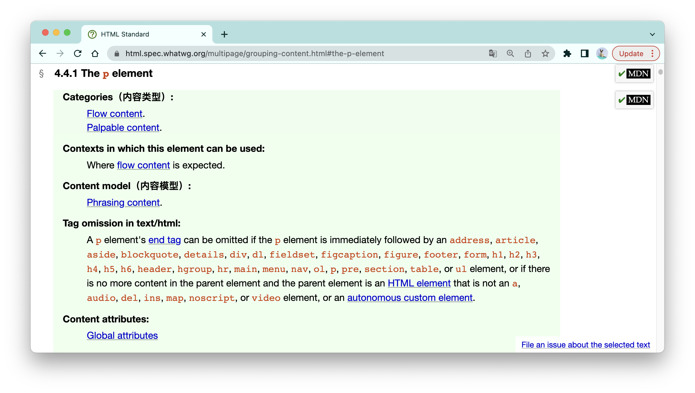
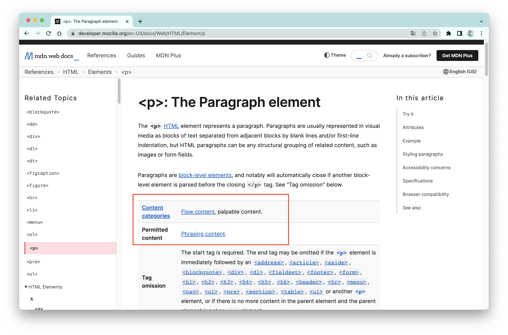
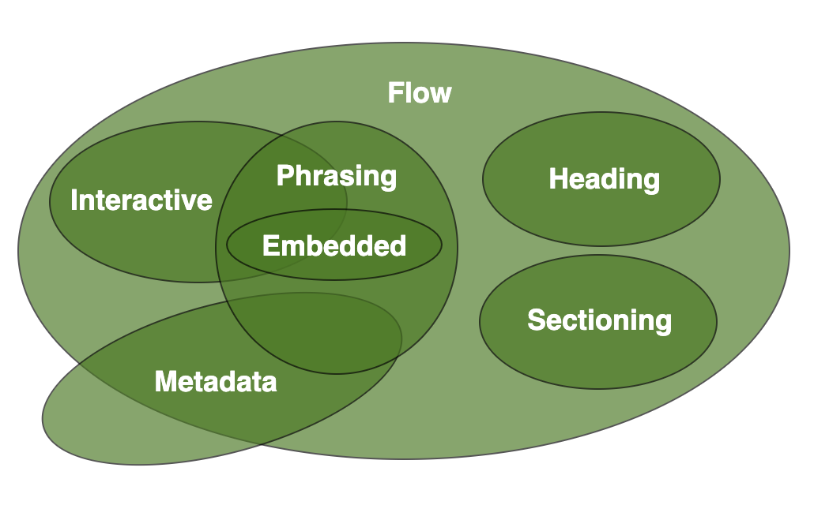
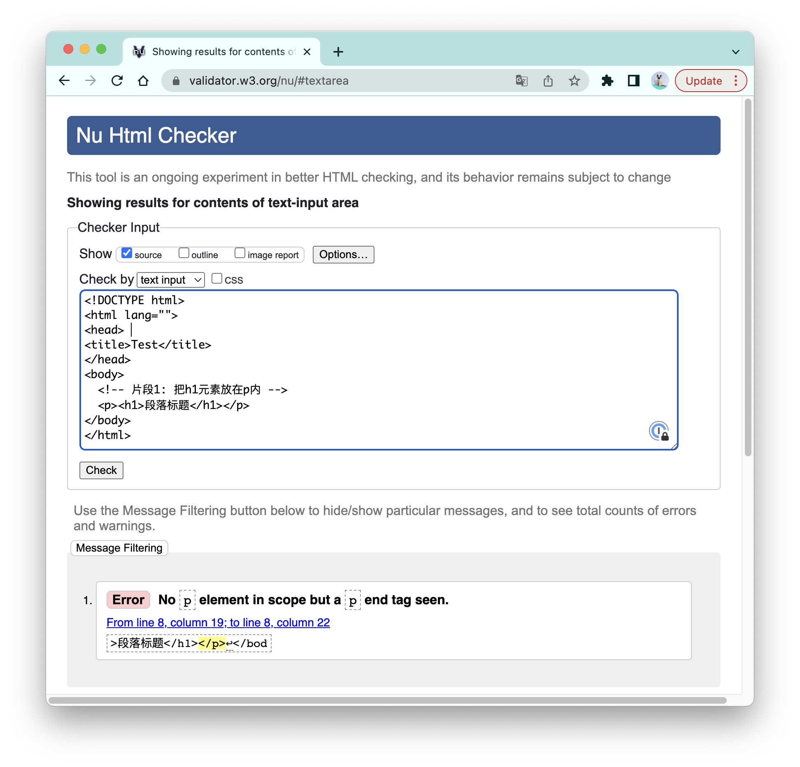

# 一文读懂HTML内容模型：如何写出符合规范的HTML？

**内容模型是HTML元素子代内容的规范，表示HTML元素所预期的子代类型。**  违背内容模型的HTML片段，有时可以侥幸“逃过一劫”，有时则会导致一些违背预期的行为，最严重的时候甚至会导致整个页面的崩溃。以下是三段违背内容模型的HTML片段：

```html
<!-- 片段1: 把h1元素放在p内 -->
<p><h1>段落标题</h1></p>

<!-- 片段2: 把meta元素放在body内 -->
<body>
  <meta http-equiv="Content-Security-Policy" content="default-src;"/>    
</body>

<!-- 片段3: 在script元素中带有</script>的字符串 -->
<script>
    const example = "script的闭合标签是</script>";
		// ...其他逻辑
</script>
```

在这三个HTML片段中，片段1实际解析出来的DOM树会跟你想的不一样：

```html
<p></p>
<h1>段落标题</h1>
<p></p> 
```

片段2的CSP策略会失效；而片段3的script标签会提前终止，标签内的其他逻辑无法正常执行。

本文，我将会基于[标准的3.2.5 Content models](https://html.spec.whatwg.org/#content-models)，为你讲清楚HTML内容模型的来龙去脉。


<br/>


### 目录:

- [内容模型的基础使用](#内容模型的基础使用)

- [10种内容类型](#10种内容类型)

  * [7种基础的内容类型](#7种基础的内容类型)

  * [3种特殊的内容类型](#3种特殊的内容类型)

- [不同形态的内容模型](#不同形态的内容模型)

- [规范检查器](#规范检查器)
<br/>


## 内容模型的基础使用

每一个已经标准化的元素都有自己所属的「内容类型（content-categories）」以及自己的「内容模型（content-model）」，这两个信息你可以在标准对每一个元素定义的[绿色方块](https://html.spec.whatwg.org/multipage/grouping-content.html#the-p-element)中找到：



又或者在相应元素的MDN解释的文档中找到（英文版才有）：



HTML标准根据元素的不同特点把所有HTML元素分为10种不同的「内容类型」，比如，把所有可以代表页面元数据的元素归类为「元数据内容」，把所有可以作为标题使用的元素归类为「标题内容」。**大部分情况下，内容模型，指的是一个元素的后代可以容纳具有怎样「内容类型」的元素。** 

举个例子： `head`元素的「内容模型」是「元数据内容」，所以所有「内容类型」为「元数据内容」的元素都可以作为`head`元素的子代，包括：`title`元素、`base`元素、`link`元素、`meta`元素、`style`元素、`script`元素、`noscript`元素、`template`元素。而其他「内容类型」不是「元数据内容」的元素，都不应该放在head元素里面，比如`body`元素。

```html
<!-- head元素的内容模型为元数据内容 -->
<head>
    <!-- 以下元素的内容类型都是元数据内容 -->
    <title></title>
    <base />
    <link />
    <meta />
    <style></style>
    <script></script>
  	<noscript></noscript>
  	<template></template>
</head>   
```

**在一棵规范的DOM树上，每一个子元素的「内容类型」都应该与其父元素的「内容模型」相匹配。** 从这个角度看，你可以把一颗DOM树看成是一整套「俄罗斯套娃」，每一层的“娃”都有两个性质：自己能被什么东西装（内容类型），以及自己能装什么东西（内容模型）。


<br/>


## 10种内容类型
<br/>


### 7种基础的内容类型

根据标准，有7种基础的内容类型，如下所示：

- **元数据内容（Metadata content）** ：可用于设置整体页面的呈现或者行为、设置本页面与其他文档之间的关系、传达其他主内容以外的信息。详见[《HTML元数据内容标签》](./4.2.md)。

  ```html
  <base>,<link>,<meta>,<noscript>,<script>,<style>,<template>,<title>
  ```

- **流式内容（Flow content）** : 绝大多数在页面body中使用的元素都归为此类。

  ```html
  <a>,<abbr>,<address>,<area>(如果是map的子代),<article>,<aside>,<audio>,<b>,<bdi>,<bdo>,<blockquote>,<br/>,<button>,<canvas>,<cite>,<code>,<data>,<datalist>,<del>,<details>,<dfn>,<dialog>,<div>,<dl>,<em>,<embed>,<fieldset>,<figure>,<footer>,<form>,<h1>,<h2>,<h3>,<h4>,<h5>,<h6>,<header>,<hgroup>,<hr>,<i>,<iframe>,,<input>,<ins>,<kbd>,<label>,<link>(如果允许在body中出现),<main>(如果层级顺序正确),<map>,<mark>,<math>(MathML),<menu>,<meta>(如果有itemprop属性),<meter>,<nav>,<noscript>,<object>,<ol>,<output>,<p>,<picture>,<pre>,<progress>,<q>,<ruby>,<s>,<samp>,<script>,<section>,<select>,<slot>,<small>,<span>,<strong>,<sub>,<sup>,<svg>(SVG),<table>,<template>,<textarea>,<time>,<u>,<ul>,<var>,<video>,<wbr>,自主自定义元素,Text Node
  ```

- **分段内容（Sectioning content）** ：用于划定header元素和footer元素的语义作用范围 ，详见[《HTML语义标签》](./4.3.md#区域类标签)。
  
  ```html
  <article>,<aside>,<nav>,<section>
  ```
  
- **标题内容（Heading content）** ：定义页面标题的内容。
  
  ```html
  <h1>,<h2>,<h3>,<h4>,<h5>,<h6>,<hgroup> (如果后代有h1~h6元素)
  ```
  
- **短语内容（Phrasing content）** ：页面的文本内容，以及段落之间标记的内容。一般来说，短语内容都是行内级元素。

  ```html
  <a>,<abbr>,<area>(如果后代是map元素),<audio>,<b>,<bdi>,<bdo>,<br>,<button>,<canvas>,<cite>,<code>,<data>,<datalist>,<del>,<dfn>,<em>,<embed>,<i>,<iframe>,,<input>,<ins>,<kbd>,<label>,<link> (如果允许在body中出现),<map>,<mark>,<math>(MathML),<meta>(如果有itemprop属性),<meter>,<noscript>,<object>,<output>,<picture>,<progress>,<q>,<ruby>,<s>,<samp>,<script>,<select>,<slot>,<small>,<span>,<strong>,<sub>,<sup>,<svg>(SVG),<template>,<textarea>,<time>,<u>,<var>,<video>,<wbr>,自主自定义元素,Text Node
  ```

- **嵌入内容（Embedded content）** ：页面中插入的外部资源。

  ```html
  <audio>,<canvas>,<embed>,<iframe>,,<math>(MathML),<object>,<picture>,<svg>(SVG),<video>
  ```

- **交互式内容（Interactive content）** ：专门用于用户交互的的内容。

  ```html
  <a>(如果有href属性),<audio>(如果有controls属性),<button>,<details>,<embed>,<iframe>,(如果有usemap属性),<input>(如果type属性不是hidden状态),<label>,<select>,<textarea>,<video>(如果有controls属性)
  ```

<br />

在这里，我们可以得到的一些结论是：

1. **一个元素可以归属于多种内容类型**。举个例子：`script`元素归属于4种内容类型，分别是元数据内容、流式内容、短语内容、支持脚本元素（这属于下面的特殊内容类型）。于是，对于`script`元素来说，被包裹在以下的元素中是完全合法的：

   ```html
   <!-- head元素的内容模型为元数据内容 -->
   <head><script></script></head>
   <!-- body元素的内容模型为流式内容 -->
   <body><script></script></body>
   <!-- p元素的内容模型为短语内容 -->
   <p><script></script></p>
   <!-- ol元素的内容模型是li元素和支持脚本元素 -->
   <ol><script></script></ol>
   ```

   另外，**一个元素也可以不归属任何的内容类型，** 如html元素、head元素等，这些元素只在特定的某一种场景中使用。

2. **Text节点也有自己的内容类型，归属于短语内容以及流式内容。** 当然，text节点是没有后代的，所以也就没有内容模型。

3. 事实上，当一个元素的内容类型属于短语内容的时候，他就必定也同时属于流式内容。**标准给我们总结了一张图，揭示这7种内容类型之间的重叠关系**：

   


<br/>


### 3种特殊的内容类型

除了上面7种基础的内容类型，还有三种特殊的内容类型。之所以说他们特殊，要么是因为这个内容类型自身不代表任何具有实际意义的内容（可感知内容、支持脚本内容），要么这个内容类型不具有通用性，只是在一个狭窄的领域实现某种特定的目的（如表单相关内容）：

- **可感知内容（palpable content）** ：通过提供非空的Text节点或者其他可听（如audio元素）、可见（如video、img或canvas元素）、可交互的内容，让该元素处于非空状态。一般来说，对于内容模型为流式内容或者短语内容的元素，它的后代应该至少有一个节点是可感知内容，且这个节点没有声明`hidden`属性。

  ```html
  <a>,<abbr>,<address>,<article>,<aside>,<audio>（如果有controls属性）,<b>,<bdi>,<bdo>,<blockquote>,<button>,<canvas>,<cite>,<code>,<data>,<details>,<dfn>,<div>,<dl>（如果元素的后代至少有一个name/value组）,<em>,<embed>,<fieldset>,<figure>,<footer>,<form>,<h1>,<h2>,<h3>,<h4>,<h5>,<h6>,<header>,<hgroup>,<i>,<iframe>,,<input>（如果type属性不是hidden状态）,<ins>,<kbd>,<label>,<main>,<map>,<mark>,<MathML math>,<menu>（如果后代至少有一个li元素）,<meter>,<nav>,<object>,<ol>（如果后代至少有一个li元素）,<output>,<p>,<pre>,<progress>,<q>,<ruby>,<s>,<samp>,<section>,<select>,<small>,<span>,<strong>,<sub>,<sup>,<SVG svg>,<table>,<textarea>,<time>,<u>,<ul>（如果后代至少有一个li元素）,<var>,<video>,自主自定义元素,非元素间空格的text节点
  ```

- **支持脚本元素（Script-supporting elements）**  ：支持脚本的元素，本身不代表任何内容。

  ```html
  <script>,<template>
  ```

- **表单相关内容（Form-associated content）** ：表示元素可以归属于某一个表单所有者（即通过使用`form`属性访问索引对应的form元素）:

  ```html
  <button>,<fieldset>,<input>,<object>,<output>,<select>,<textarea>,,表单相关自定义元素
  ```

  对于这些元素，还可以进一步细分为可列举元素（Listed elements）、可提交元素（Submittable elements)、可重置元素（Resettable elements)、继承自动大写元素（Autocapitalize-inheriting elements）、可标记元素（Labelable elements）。关于表单相关内容，可以阅读我的另一篇文章：[《详解HTML表单元素》](./4.10.md)


<br/>


## 不同形态的内容模型

内容模型的声明其实是非常自由。

声明一个元素的内容模型，最简单的形态就是就是直接贴上上面列出的十种内容类型的其中一种，如上面p元素的例子：

> Content model: Phrasing Content.
>
> （p元素的）内容模型：短语内容。

**内容模型也可以是特定元素。** 比如[html元素的内容模型](https://html.spec.whatwg.org/#the-html-element)：

> Content model: A head element followed by a body element.
>
> （html元素的）内容模型：一个head元素，紧跟着一个body元素。

**内容模型还可以根据不同的上下文定制不同的内容。** 比如[head元素的内容模型](https://html.spec.whatwg.org/#the-head-element)：

> Content model：
>
> ​	If the document is an iframe srcdoc document or if title information is available from a higher-level protocol: Zero or more elements of metadata content, of which no more than one is a title element and no more than one is a base element.
>
> ​	Otherwise: One or more elements of metadata content, of which exactly one is a title element and no more than one is a base element.
>
> （head元素的）内容模型：
>
> ​		如果文档是一个iframe srcdoc文档，或者如果title信息已经在更高层级的协议中可获得：零个或多个元数据内容，且里面有不多于一个的title元素以及不多于一个的base元素。
>
> ​		否则：一个或多个元数据内容，且里面有且只有一个title元素以及不多于一个的base元素。

**还有两种特殊的内容模型：虚无内容模型（The "nothing" content model）以及透明内容模型（Transparent content models）。** 

- 虚无内容模型：元素的后代不包含非空text节点以及元素节点。大多数虚无内容模型的元素都没有闭合标签，比如img元素、link元素。

- 透明内容模型：元素的内容模型由父元素的内容模型决定。标准里面举了一个例子：

  > ```js
  > <p><object><param><ins><map><a href="/">Apples</a></map></ins></object></p>
  > ```
  >
  > 对于"Apples"是否可以放在a标签里，检测过程是这样的：a元素的内容模型是透明内容模型，map元素也是，ins元素也是，object元素也是，最后p元素的内容模型是短语内容，由于"Apples"是text节点，短语内容的一种，所以"Apples"在这里是合法的。


<br/>


## 规范检查器

HTML标准里面给过一个工具，叫[conformance checker](https://validator.w3.org/nu/#textarea)，规范检查器。通过输入一段HTML片段，或者一个地址，它会给你指出HTML片段中与标准要求不一致的地方：



而这个工具所使用的其中一种重要的检测规则，就是HTML的内容模型。你可以尝试把开篇的三个HTML片段放进这个检查器，查看它的报错。

到这里，你应该很清楚开篇三个违背内容模型的例子问题出在哪里了：

```html
<!-- 片段1: 把h1元素放在p内 -->
<p><h1>段落标题</h1></p>
```

在片段1中：p元素的内容模型为短语内容，而h1元素的内容类型为标题内容，所以这显然是违背了内容模型的。

```html
<!-- 片段2: 把meta元素放在body内 -->
<body>
  <meta http-equiv="Content-Security-Policy" content="default-src;"/>    
</body>
```

在片段2中：body元素的内容模型为流式内容，而在没有`itemprop`属性的情况下，meta元素的内容类型为元数据内容，所有这也违背了内容模型。

```html
<!-- 片段3: 在script元素中带有</script>的字符串 -->
<script>
    const example = "script的闭合标签是</script>";
		// ...其他逻辑
</script>
```

所有HTML元素中，script元素的内容模型是最复杂的了。对于如何写出规范的script内容，我在[详解script标签](./4.12.md#js传统脚本)中进行了深入的探讨。
