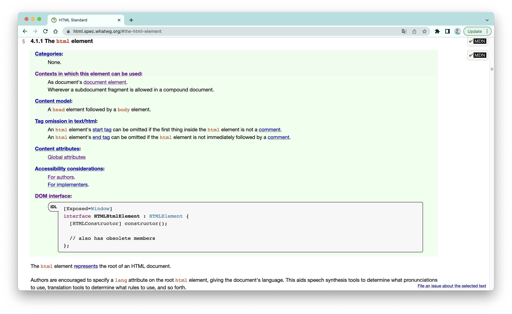
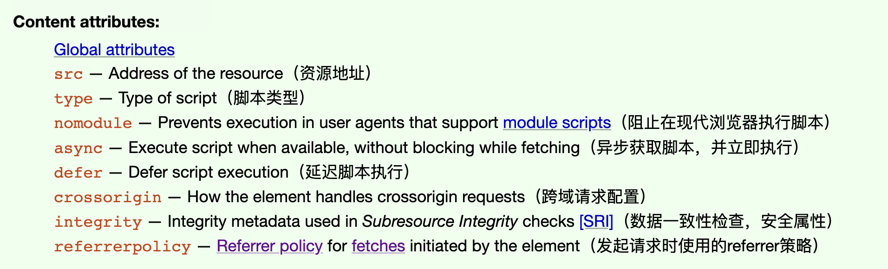

# 《HTML标准》元素定义模版：定义一个元素会考虑哪些方面？

在整个HTML标准中，篇幅最长的一个章节是第四章，几乎占据了整个标准一半的内容。这一章名为“HTML元素”，完整地定义了110多个HTML元素。大部分人并不会一点一点地去阅读这里面的内容，而是把这个部分当成一种参考资料，这是合理的。

不过好比查字典前，你得先明白查字典的规则；在查看特定元素的标准定义前，你也应该先知道标准定义每一个元素的模版是怎么样的，模版中的每一个部分又具体代表什么意思，这样才不致于看得“一头雾水”。


<br/>


### 目录:

- [元素定义的模版](#元素定义的模版)

  * [绿色方块](#绿色方块)

  * [补充信息](#补充信息)

- [标准对HTML元素的分类](#标准对html元素的分类)
<br/>


## 元素定义的模版

每一个HTML元素的定义，是由一个绿色方块，以及绿色方块下面的补充信息构成的，以`html`元素为例:




<br/>


### 绿色方块

每个绿色小方块都包含如下内容：

- **内容类型（Categories）** ：元素所属的内容类型的列表。
- **元素可以被使用的上下文（Contexts in which this elements can be used）** ：元素所预期的父代，是内容类型的补充信息。
- **内容模型（Content model）** ：定义元素所预期的子代。
- **标签的可忽略性（Tag omission in text/html）** ：起始标签或闭合标签是否可以忽略。
- **内容属性（Content attributes）** ：元素可使用的属性列表。
- **可访问性考量（Accessibility considerations）** ：分成两个部分，一部分是对于网页开发者（authors）的要求，另一部分是对于浏览器实现者（implementers）的要求。
- **DOM接口（DOM interface）** ：该元素的所实现的DOM接口，用web IDL定义。

<br />

**对于「内容类型」、「元素可以被使用的上下文」、「内容模型」这三栏**：我已经在[《一文读懂HTML内容模型》](./3.2.md)进行详尽的讲解，这里就不再重复了。

<br />

**对于「标签的可忽略性」这一栏**，会有三种可能：

- `Neither tag is omissible`：这是大多数元素的情况，表示起始与闭合标签都不可忽略；

- `No end tag`：表示没有闭合标签。一般来说，对于内容模型为`nothing`的元素，由于没有后代，所以是没有闭合标签的。

- 其他的情况：对于一些特定的元素，他们有自己标签忽略的规则，所有的这些规则都可以归为这一类，标准已经为我们做了一个[完整的总结](https://html.spec.whatwg.org/#optional-tags)了。这里会有很多你意想不到的情况。比如，如果html元素内第一个节点不是注释节点，那么html元素的起始标签是可以被忽略的，所以下列HTML片段是完全合法的：

  ```html
  <!DOCTYPE HTML>
    <head>
      <title>Hello</title>
    </head>
    <body>
      <p>Welcome to this example.</p>
    </body>
  </html>
  ```

<br />

**对于「内容属性」这一栏**，你一定会看到一个叫`Global attributes`的东西，这是所有HTML元素都共享的[全局属性](https://html.spec.whatwg.org/#global-attributes)。

除了全局属性，剩余的就是元素的专有属性。一般来说，除了事件监听属性，其他属性都会以「属性名 — 属性功能概括」的格式呈现，以[script元素](https://html.spec.whatwg.org/multipage/scripting.html#the-script-element)的内容属性为例：



<br />

**对于「可访问性考量」这一栏**：与元素的可访问性相关，是[ARIA草案](https://w3c.github.io/html-aam/)的内容，包含对浏览器（implementers）的实现要求以及开发者（authors）的要求两个部分。

<br />

**对于「DOM接口」这一栏**：我已经在[《一文读懂web IDL》](./2.6.md)里进行详尽的讲解，这里就不再重复了。


<br/>


### 补充信息

在绿色小方块下面的补充文本中，主要说3个事情：

- 该HTML元素的语义。
- 对于开发者的要求：如何正确使用该元素。
- 对于浏览器实现的要求：如何正确实现该元素。

<br />

通常来说，补充文本的第一段话，就是对元素语义的定义。大多数元素都有自己的语义，也就是他们内容所表达的含义。在标准中会使用represent这个动词来定义语义。比如，[head](https://html.spec.whatwg.org/multipage/semantics.html#the-head-element)和[header](https://html.spec.whatwg.org/multipage/sections.html#the-header-element)是两个从名字上看起来很相似的元素，但他们实际上代表着完全不一样的东西：

> The head element represents a collection of metadata for the Document.
>
> The header element represents a group of introductory or navigational aids.
>
> head元素代表文档中的元数据集合。
>
> header元素代表一组介绍或者导航辅助的内容。

<br />

HTML标准的两个最主要的读者群，就是开发者以及浏览器实现者（准确的说是用户代理，User Agent/implementer）。

对于开发者，标准在补充信息中会对元素的正确使用进行进一步的展开，包括每一个属性是什么？怎么用？有哪些常见的错误使用方式？通常还会附带注释和例子来讲解。

对于浏览器实现者，标准会对元素各个方面的处理模型(processing models)列出详细的算法步骤，比如元素获取目标资源的过程。对于如何看懂这些算法，我在[《如何读懂标准中的算法》](./2.3.md)做了详尽的解释。


<br/>


## 标准对HTML元素的分类

当我们想要寻找标准对某个元素的定义时，我们可以直接在[第四章的目录](https://html.spec.whatwg.org/multipage/#toc-semantics)进行一个全文检索，然后通过目录导航到对应的章节就可以了。

另一方面，通过第四章的目录，我们也可以看出标准是如何给元素进行归类的：

- 4.1 文档根元素：即html元素。
- 4.2 文档元数据元素：head元素里面的内容，可见[《详解元数据内容》](./4.2.md)。
- 4.3-4.5 文档结构与语义相关元素：可见[《详解语义标签》](./4.3.md)。
- 4.6 文档链接元素：a、area、link、form元素的链接功能。可见[《详解链接元素》](./4.6.md)。
- 4.7 文档编辑元素：ins和del元素。
- 4.8 嵌入式元素：多媒体资源元素、iframe元素等，可见[《详见iframe》](./4.8.md)。
- 4.9 表格相关的元素：table及其相关子元素。
- 4.10 表单相关元素：form及其相关子元素，可见[《详见form相关元素》](./4.10.md)。
- 4.11 交互式元素：details、summary、dialog元素。
- 4.12 脚本元素：script、noscript、template、slot、canvas元素，可见[《详解script元素》](./4.12.md)。
- 4.13 自定义元素

我对这里的一部分内容进行了展开，具体链接已经贴在了每一项的后面了。其他的部分会在未来的某个时间进行补充，敬请关注！

