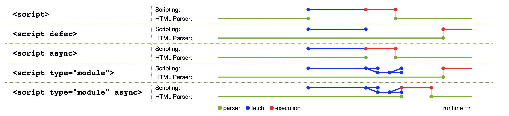

# script标签4种的四种用法，你知道几种？

在一个HTML页面中执行js脚本有很多方式，包括但不限于以下几种：

- 使用script标签执行脚本；
- 使用`javascript:URL`的导航；
- 使用DOM上的事件监听机制；
- 使用svg相关技术中的脚本能力；

在这些方式中，使用最多的无疑是第一种。script标签允许开发者给页面插入js脚本，而根据`type`属性的值，可以把script元素分成4种不同的类型：

| 类型                         | 对应的type属性值                                             | 描述                                                         |
| ---------------------------- | ------------------------------------------------------------ | ------------------------------------------------------------ |
| js传统脚本（classic script） | 没有声明type属性，或type属性值为空，或type属性值匹配任一[JavaScript MIME类型](https://mimesniff.spec.whatwg.org/#javascript-mime-type)（如`text/javascript`）。 | 以ECMAScript顶层Script语法规则进行解析的脚本。               |
| js模块脚本（module script）  | "module"                                                     | 以ECMAScript顶层Module语法规则进行解析的脚本。               |
| Imports map                  | "importmap"                                                  | 控制页面内模块标识符(module specifier)的解析。               |
| 数据块                       | 除了上述以外的其他值                                         | 浏览器不会被对其作处理，内部的文本可以作为数据在其他脚本中时候。 |

对于前面三种类型，可以使用`HTMLScriptElement.supports(type)`的方法来检测浏览器是否支持这些类型，对应的参数`type`分别是`classic`、`module`或`importmap`。


<br/>


### 目录:

- [js传统脚本](#js传统脚本)

- [js模块脚本](#js模块脚本)

- [importmap](#importmap)

- [数据块](#数据块)
<br/>


## js传统脚本

js传统脚本是我们使用最多的script类型。我们可以在标签内直接写js代码，也可以通过src属性引入一个外部的js文件。

基于历史原因，script标签内容的解析有一些奇怪的规则。比如，以下的script标签都无法按照预期运行：

```html
<!-- 1: script标签把字符串内容</script>看成是闭合标签 -->
<script>
    const example = "script的闭合标签是</script>";
    console.log(example);
</script>

<!-- 2: script标签把<!--看成是注释的起始标签 -->
<script>
    if (x <!--y) { ... }
</script>
```

为了避免这些坑，标准建议把所有script标签里的字符串、正则表达式、注释内容里面的`<!--`、`<script`、`</script`都使用`\x3C!--`、`\x3Cscript`、`\x3C/script`转义，并且避免在js表达式中使用这类写法。所以，以上的问题可以这么修正：

```html
<script>
    const example = "script的闭合标签是\x3C/script>";
    console.log(example);
</script>

<script>
    if (x < !--y) { ... }
</script>
```


<br/>


## js模块脚本

把代码拆解成不同的模块是程序员应对复杂度的一个重要手段。在js模块脚本获得浏览器原生支持之前，我们只能通过一些间接手段达成模块化的目标，如使用webpack这样的打包工具。

从es6开始，浏览器原生支持模块化。现在你可以使用`type="module"`声明js模块脚本。在以下的script标签中，app.js及其依赖都会被浏览器获取：

```html
<script type="module" src="app.js"></script>
```

基于历史原因，js传统脚本的获取以及执行都会阻塞HTML解析。对于这种情况，你可以使用`async`属性促使浏览器异步获取脚本，又或者使用`defer`属性延迟到HTML解析完毕后才执行脚本。对于js模块脚本，默认是异步获取的，并且在HTML解析完成后才开始执行。你可以使用`async`属性让js模块脚本在完成获取后立即执行，如果这个时候HTML还未完成解析，解析就会被脚本的执行阻塞；`defer`属性对js模块脚本无影响。

`async`属性、`defer`属性与HTML解析过程在运行时上的关系，可以用下面一张图总结：



<br />

js模块脚本除了导入js模块，还可以导入css模块以及json模块，但需要使用`assert`语句声明其类型：

```html
<script type="module">
    import json from 'example.json' assert {type: 'json'}
    import css from 'example.css' assert {type: 'css'}
    // ...
</script>
```


<br/>


## importmap

importmap是一个最近（2022年10月5日）才[正式写入标准](https://github.com/whatwg/html/commit/ef77849222a008814bab60cef08a51ca66c2f80f)的脚本类型。

任何的模块系统，不管是AMD、commonJs还是es6模块，都有「模块标识符」的概念。模块标识符用于索引一个模块，你可以简单地理解为是模块的名字。很多时候，模块标识符就是代码所在位置的路径，比如下面的代码中，`"/node_modules/moment/src/moment.js"`就是这个文件对应的模块的模块标识符：

```js
import moment form "/node_modules/moment/src/moment.js"
```

在importmap之前，es6模块的模块标识符只支持像上面这样的实际路径，而importMap可以实现对模块标识符的重新映射。比如下面的例子，把`"/node_modules/moment/src/moment.js"`映射到`"moment"`上；于是，该页面中所有的js模块脚本，都可以统一使用`import XXX from "moment"`引入这个模块：

```html
<script type="importmap">
    {
        "imports": {
          "moment": "/node_modules/moment/src/moment.js"
        }
      }
</script>
<script type="module">
    import moment from "moment"
    // ...
</script>
```

每一个页面最多只能有一个importmap。importmap需要使用一个内联的json表示，这个json支持两个顶层的键：

- `imports`：作用于全局的映射，如上面所示。

- `scopes`：作用于局部映射。常用于在页面内使用同一模块的不同版本，比如以下这个例子：

  ```html
  <script type="importmap">
      {
          "scopes": {
            "/a/" : {
              "moment": "/node_modules/moment/src/moment.js"
            },
            "/b/" : {
              "moment": "https://cdn.example.com/moment/src/moment.js"
            }
          }
        }
  </script>
  ```

  当使用`import "moment"`的时候，不同位置下的脚本会有不同的情况：

  - 位于`/a/`下的脚本，会引入`"/node_modules/moment/src/moment.js"`；
  - 位于`/b/`下的脚本，会引入`"https://cdn.example.com/moment/src/moment.js"`；
  - 位于`/c/`下的脚本，会报错。


<br />

importmap还支持多种类型的模块标识符：

- 裸标识符（Bare specifiers），不带有斜杠`/`的标识符，如上面的moment。

- 以斜杠结尾的标识符：可用于映射一类的路径。

  ```html
  <script type="importmap">
      {
          "imports": {
            "moment/": "/node_modules/moment/src/"
          }
      }
  </script>
  <script type="module">
      import localeData from "moment/locale/zh-cn.js"
    	// ...
  </script>
  ```

- URL类标识符：包括绝对路径和相对路径。

  ```json
  {
    "imports": {
      "https://cdn.example.com/vue/dist/vue.runtime.esm.js": "/node_modules/vue/dist/vue.runtime.esm.js",
      "/js/app.mjs": "/js/app-8e0d62a03.mjs",
      "../helpers/": "https://cdn.example/helpers/"
    }
  }
  ```

<br />

在现实中，[three.js](https://github.com/mrdoob/three.js)很早就在[使用importmap](https://github.com/mrdoob/three.js/search?p=3&q=type%3D%22importmap%22)了，不过是配合着垫片(shim)使用的。


<br/>


## 数据块

当script标签的`type`属性不匹配js传统脚本、js模块脚本、importmap任一类型的时候，浏览器会直接忽略这个标签。这种标签在实际开发中经常被用来当作数据块使用。

比如，你可以使用数据块存放一张游戏地图，这个数据块可以用于运行游戏的时候生成地图，也可以用在站内检索，提供特定的能力。

```html
<script src="game-engine.js"></script>
<script type="text/x-game-map">
........U.........e
o............A....e
.....A.....AAA....e
.A..AAA...AAAAA...e
</script>
```

我们也可以看一些现实中的例子：

- [systemjs](https://github.com/systemjs/systemjs)：systemjs使得开发者可以在老式浏览器上使用es6模块的语法。它使用`type="systemjs-module"`以及`type="systemjs-importmap"`的script标签分别模拟js模块脚本和importmap，这种script标签本质上就是一个数据块，浏览器并不会对这些script标签作任何处理，这些标签会留给systemjs内部[进行处理](https://github.com/systemjs/systemjs/blob/main/src/features/import-maps.js#L30)，从而模拟加载模块的过程：

  ```html
  <script src="system.js"></script>
  <script type="systemjs-importmap">
  {
    "imports": {
      "lodash": "https://unpkg.com/lodash@4.17.10/lodash.js"
    }
  }
  </script>
  <script type="systemjs-module" src="/js/main.js"></script>
  ```

- [three.js](https://github.com/mrdoob/three.js)：threejs是一个3D库。在它的[示例](https://github.com/mrdoob/three.js/blob/034343d97134c55559aa4edbcce3d405eae308da/examples/webgl_shader2.html#L33)中，常常使用数据块来存放3D渲染模型的数据，如`type="x-shader/x-vertex"`、`type="x-shader/x-fragment"`的script标签。

  ```html
  <script id="procedural-vert" type="x-shader/x-vertex">
  	varying vec2 vUv;
  
  	void main() {
  		vUv = uv;
  		gl_Position = projectionMatrix * modelViewMatrix * vec4(position, 1.0);
  	}
  </script>
  ```

- JSON-LD，使用`type="application/ld+json"`的script标签中声明页面中的结构化数据，详见[《HTML微数据》](./5.0.md#结构化数据的其他格式)。


值得一提的是，标准建议：在使用数据块的时候，最好使用符合格式的[MIME类型](https://www.rfc-editor.org/rfc/rfc7231#section-3.1.1.1)，避免标准在未来增加新的类型的时候发生冲突：

```js
"text/html" // 符合格式
"text/html;" // 不符合格式
"text/html;charset=uft-8" // 符合格式
```

