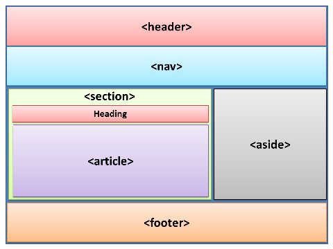

# 《HTML标准》解读：详解语义类标签

HTML的中文名叫做「超文本标记语言」，我曾在[《HTML发展史》](./1.6&1.8.md#2-sgml的诞生标记语言的突破性变革)一文中谈到，标记语言可以分为三类：

- 表示性标记语言：要求所见即所得，一般配合一个可视化的UI界面，比如word。
- 过程式标记语言：用一连串的指令符号指导系统呈现内容的方式，比如markdown。
- 描述性标记语言：强调描述内容的含义（WHAT）而不是具体呈现（HOW），HTML、XML就是归于这一类。

所以HTML天生是带有“语义”的。这种特点使得它相比于其他的标记语言可以有更加灵活的呈现：

- 对于浏览器来说：可以根据语义调整内容的呈现。比如基于内容结构生成快速导航栏，跨页面生成一个目录索引。一些小屏幕，比如手机浏览器，可以基于自身尺寸调整标题和文本的大小、粗细。
- 对于视觉障碍的用户：可以提高为这些用户朗读的效果，比如强调的地方就使用重音，标题就读慢一点等等；
- 对于搜索引擎：可以基于语义给内容建立索引，提高检索效率；
- 对于开发者：由于内容本身带有语义，所以可以更好地维护。

不过，不同类型的标记语言并非界限分明的。比如，word文档现在也支持导出XML文件了。又比如，当你用不好HTML语义标签的时候，就有可能把HTML“降级”为表示性标记语言。

而掌握语义标签也并非易事。一方面，语义标签数目众多；另一方面，有的标签的语义是很相近的，容易混淆，比如`<article>`和`<section>`、各种可以加粗的标签。对此，我们应该先把所有的语义类标签做好一个大的分类，然后再“逐个击破“。


<br/>


### 目录:

- [语义类标签的分类](#语义类标签的分类)

  * [区域类标签](#区域类标签)

  * [组合内容类标签](#组合内容类标签)

  * [文本级标签](#文本级标签)
<br/>


## 语义类标签的分类

分类是降低认知成本有效手段。依据标准，可以根据标签“描述范围”的大小，从大到小把语义类标签分为3个类别：

- 区域类（Sections）标签：主要描述整体页面的结构以及标题。

  ```html
  <body>,<article>,<section>,<nav>,<aside>,<h1>...<h6>,<hgroup>,<footer>,<address>
  ```

- 组合内容类（Grouping content）标签：组织不同段落、句子的标签。
  ```html
  <p>,<hr>,<pre>,<blockquote>,<ol>,<ul>,<menu>,<li>,<dl>,<dt>,<dd>,<figure>,<figcaption>,<main>,<div>
  ```

- 文本级（Text-level）标签：通常作用在句子上或句子内的词组，表达特定的句意或词意。

  ```html
  <a>,<em>,<strong>,<small>,<s>,<cite>,<q>,<dfn>,<abbr>,<ruby>,<rt>,<rp>,<data>,<time>,<code>,<var>,<samp>,<kbd>,<sub>,<sup>,<i>,<b>,<u>,<mark>,<bdi>,<bdo>,<span>,<wbr>
  ```

一般情况下，”描述范围“大的标签可以包裹着”描述范围“小的标签，即区域类标签可以包裹组合内容类标签和文本级标签，组合内容类标签可以包裹文本级标签。**区域类标签以及组合内容类标签都对应着块级元素，文本级标签对应行内级元素。** 


<br/>


### 区域类标签

区域类标签用来表达页面的整体结构，划分页面的区域。一种常见的页面布局如图所示：



先简单说一下这些标签的含义：

- `<article> `：表示页面内一个完整独立的内容，可以单独分发或者复用。比如一个论坛帖子、杂志新闻文章、用户评论、或者页面内独立的应用。
- `<section>`：表示页面内的一个区域，通常包裹着其他的内容，比如标题。
- `<nav>`：页面内的导航内容。
- `<aside>`：表示与主内容无关的内容，如广告，通常以侧边栏展示。
- `<header>`：表示介绍性的内容或者导航辅助。
- `<footer>`：通常包含作者信息、相关文档链接、版权信息、点赞数等等。
- `heading`类元素：标题相关元素，包括h1-h6以及hgroup。hgroup标签与p标签配合可以用来引入副标题。

<br />

`<article>`和`<section>`是两个比较容易混淆的标签，他们之间可以互相嵌套。他们区别在于，**article强调“整体”，而section强调“部分”。** 比如，对于一篇相亲的帖子，帖子本身是一个独立的整体，所以可以使用article标签；帖子里介绍了两个不同的男嘉宾，则可以分别使用两个section标签表示：

```html
<article>
	<h2>本期男嘉宾：</h2>
  <section>
  	<h3>男A</h3>
  	<p>职业：公务员</p>
  	<p>...</p>
	</section>
	<section>
  	<h3>男B</h3>
  	<p>职业：程序员</p>
  	<p>...</p> 
 	</section>
</article>
```

而在一个论坛页面中，评论区属于这个页面中的一个重要组成部分，可以使用section表示；又由于每一条评论都是独立的，所以可以使用article表示：

```html
<section id="comment-system">
    <article class="comment">
        <!-- ... -->
        <p>闭眼选A</p>
    <article>
    <article class="comment">
        <!-- ... -->
        <p>B的各方面条件都很好，所以我选A。</p>
    <article>
</section>
```

<br />

我们在[《HTML内容模型》](./3.2.md#7种基础的内容类型)一文中提到过，article、section、nav、aside的内容类型都是分段内容，划定了header元素和footer元素语义上作用的范围。这个意思是：当header和footer放在这些标签里面使用的时候，他们的语义范围被限制在这些标签里面，仅仅表示这些标签里内容的header、footer信息；如果header、footer不在这些标签里面使用，则表达的是整个页面的header、footer信息。如图所示：


黄色的header、footer的语义作用限定在section中，而蓝色的header、footer的语义作用在整个文档上。


<br/>


### 组合内容类标签

组合内容标签主要用来组织不同的段落或者句子。

在这个类别里，有4种HTML的列表，分别是：

- 有序列表：ol、li
- 无序列表：ul、li
- 工具栏列表：menu、li
- 描述列表：dl、dt、dd

前两种我相信大家都很熟悉了，这里就不再多说。

工具栏列表，主要用来表示一组用户可以进行操作的指令的集合，会以无序列表的形式呈现。比如一个文本编辑器：

```html
<menu>
 <li><button onclick="copy()">复制</button></li>
 <li><button onclick="cut()">剪切</button></li>
 <li><button onclick="paste()">粘贴</button></li>
</menu>
```

描述列表用来表示一组名值组（name-value groups）的列表，使用场景包括术语表、Q&A等等。不严谨的说，如果说前三种列表对应的数据结构是Set，那么描述列表对应的数据结构就是Map。比如，使用描述列表可以用来表示作者信息：

```html
<dl>
  <dt> 作者 </dt>
  <dd> 张三 </dd>
  
  <dt> 编辑 </dt>
  <dd> 李四 </dd>
  
  <dt> 审核 </dt>
  <dd> 王五 </dd>
</dl>
```

之所以说「不严谨」，是因为在描述列表中，dt和dd可以是一对一、一对多、多对多、多对一的关系，这也是为什么定义里使用的是「名值组」而不是「名值对（name-value pairs）」。以下的写法都是符合规范的：

```html
<!-- 作者：张三、李四 -->
<dl>
  <dt> 作者 </dt>
  <dd> 张三 </dd>
  <dd> 李四 </dd>
</dl>

<!-- 作者及编辑：张三 -->
<dl>
  <dt> 作者 </dt>
  <dt> 编辑 </dt>
  <dd> 张三 </dd>
</dl>

<!-- 作者及编辑：张三、李四 -->
<dl>
  <dt> 作者 </dt>
  <dt> 编辑 </dt>
  <dd> 张三 </dd>
  <dd> 李四 </dd>
</dl>
```

<br />

其他比较有意思的组合内容类标签是：

- `<blockquote>`：表示引用其他外部资料的内容。
- `<figure>`、`<figcaption>`：可用于给图片、代码、图表等内容添加注释。

比如，以下HTML片段给一句名人名言添加注释：

```html
<figure>
 <blockquote>
  <p>JavaScript是世界上最好的语言。</p>
 </blockquote>
 <figcaption>-- 鲁讯</figcaption>
</figure>
```


<br/>


### 文本级标签

文本级标签生成的都是行内级元素。常用于给特定的词组或句子标记语义。

这一类标签又多又杂，而且常常容易混淆。比如，有四种浏览器默认加粗的标签，但他们表达的语义是有差异的：

- `<strong>`：表示重要的、严重的、紧急的内容。
- `<em>`：表示强调内容，通常是强调语气。
- `<mark>`：表示高亮，多在引用中使用。
- `<b>`：用于吸引注意力但又不传达额外的重要性，比如摘要中的关键词，又或者web app里一些可以交互的文字。

我知道，重要、强调、高亮、吸引注意力，这些词的边界是非常模糊的，所以必须使用例子才能表达清楚：

`<strong>`的使用：

```html
<!-- 表达重要性，可以用在标题中 -->
<h1>HTML标准解读：<strong>HTML语义标签</strong></h1>

<!-- 表达严重性 -->
<p><strong>警告：</strong>严禁带薪拉屎。</p>

<!-- 表达紧迫性 -->
<p>如果办公室着火，切记以下三件事:</p>
<ul>
    <li><strong>git commit</strong></li>
    <li><strong>git push</strong></li>
    <li>逃跑</li>
</ul>
```

对于`<em>`，在一个句子中的不同地方使用`<em>`会改变整个句子的意思：

```html
<!-- 无强调 -->
<p>产品经理：“这个需求很简单。”</p>

<!-- 强调说话的人，可能语境中有人认为这个话是程序员自己说的 -->
<p><em>产品经理</em>：“这个需求很简单。”</p>

<!-- 强调需求，可能语境中产品经理刚提了另一个很难的需求 -->
<p>产品经理：“这个<em>需求</em>很简单。”</p>

<!-- 强调简单，可能语境中程序员认为这个需求很难 -->
<p>产品经理：“这个需求很<em>简单</em>。”</p>
```

对于`<mark>`，当在引用文本中使用时，表示突出原有文本没有的意思。当在页面主要内容中使用时，表示这个部分很可能跟用户当前的活动有关：

```html
<!-- 突出原有文本没有的意思 -->
<p>高亮的部分就是这位同事代码有误的地方:</p>
<pre><code>
    const a = 10;
    <mark>a = 100;</mark>
</code></pre>

<!-- 与当前用户的活动相关，比如用户在检索「困难」的时候 -->
<p>有<mark>困难</mark>要上,没有<mark>困难</mark>创造<mark>困难</mark>也要上。</p>
```

如果使用`<strong>`、`<em>`、`<mark>`都无法表达的意思，那么通常就是用`<b>`，比如摘要中的关键词，又或者web app里一些可以交互的文字。比如，新闻文章的第一句常常可以会用加粗标识，以下是一篇[BBC的新闻](http://news.bbc.co.uk/2/hi/uk_news/scotland/north_east/7101506.stm)：

```html
<article>
 <h2>Kittens 'adopted' by pet rabbit</h2>
 <p><b class="lede">Six abandoned kittens have found an
 unexpected new mother figure — a pet rabbit.</b></p>
 <p>Veterinary nurse Melanie Humble took the three-week-old
 kittens to her Aberdeen home.</p>
[...]
```

<br />

剩余的文本级标签，我用一张表给你总结他们的含义：

| 标签名                   | 含义                                                 |
| ------------------------ | ---------------------------------------------------- |
| `<a>`                    | 表示一个超链接。                                     |
| `<small>`                | 表示一个补充注释，常用在免责声明、法律限制、版权中。 |
| `<s>`                    | 表示内容不再准确、不再相关。                         |
| `<cite>`                 | 表示一个作品的标题。                                 |
| `<q>`                    | 表示他人说的话的引用。                               |
| `<dfn>`                  | 表示一个术语的定义。                                 |
| `<abbr>`                 | 表示缩写。                                           |
| `<ruby>`、`<rt>`、`<rp>` | 表示汉字注音。                                       |
| `<data>`                 | 表示给机器阅读的内容。                               |
| `<time>`                 | 表示时间。                                           |
| `<code>`                 | 表示一段代码。                                       |
| `<var>`                  | 表示一个变量。                                       |
| `<samp>`                 | 表示样本或计算机系统、程序的输出。                   |
| `<kbd>`                  | 表示用户输入。                                       |
| `<sub>`、`<sup>`         | 表示上下标字符。                                     |
| `<i>`                    | 表示带有不同感情的词组。                             |
| `<u>`                    | 表示错误拼写的词组。                                 |
| `<bdi>`                  | 表示文本与周边内容隔离，主要用于双向文本格式。       |
| `<bdo>`                  | 显式声明文本方向。                                   |
| `<span>`                 | 不表示任何东西。使用子代作为它的意义。               |
| `<br>`                   | 表示换行。                                           |
| `<wbr>`                  | 表示可换行的部分。                                   |

