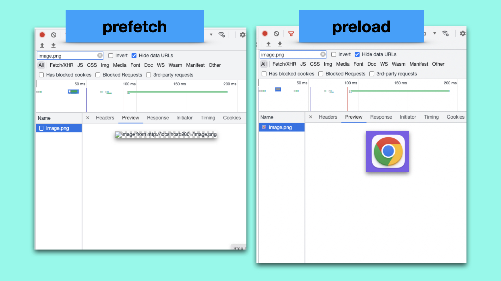

# 《HTML标准》解读：详解链接元素

我曾在[《HTML发展史》](1.6&1.8.md)一文中讲过，HTML之所以能在众多标记语言中脱颖而出，是因为其连接其他资源的能力。因此，「链接」是HTML的一个重要概念，它代表了当前页面与目标资源之间的连接。

在HTML中，有两种类型的链接：

- 外部资源型：按照一定的规则导入外部资源到页面中。
- 超链接型：导航到外部资源的入口，比如访问其他页面或者下载其他资源。

有4种HTML元素可以创建链接，分别是a、area、form、link元素。并且，这些元素都是通过`rel`属性声明链接的类型（`rel`是relationship的缩写），如：

```html
<!-- 外部资源型链接：提前获取image.png,未来页面中很可能用到这个图片 -->
<link rel="prefetch" href="https://example.com/image.png">

<!-- 超链接：目标资源是帮助页面 -->
<a rel="help" href="help.html">帮助</a>
```

所有的rel属性的关键词可以用下面一张表进行总结（不要被这一大串的关键词吓到，本文剩余的部分会有逻辑地将这些关键词串联起来）：


从这张表我们至少可以得出以下信息：

1. 只有link元素可以创建外部资源型链接（如表格的第一部分所示）。
2. a元素与area元素在创建链接的层面上表现是完全一致的。
3. 有一部分关键词仅仅用于给超链接提供注释，而不直接创建超链接（如表格的第三部分所示）。


<br/>


### 目录:

- [外部资源型](#外部资源型)

  * [预处理资源的链接](#预处理资源的链接)

  * [导入特定类型资源的链接](#导入特定类型资源的链接)

- [超链接型](#超链接型)

- [给超链接提供注释](#给超链接提供注释)

- [自定义链接类型](#自定义链接类型)
<br/>


## 外部资源型
<br/>


### 预处理资源的链接

在外部资源型链接中，很大一部分是为页面中未来可能用到的资源做一些预处理的。

我们知道，获取外部资源一般要经历如下步骤：

1. 对资源URL进行DNS解析；
2. 建立TCP链接 ；
3. 发起请求获取资源；
4. 根据资源的类型，对资源进行进一步的处理（如解析图片，或者创建样式表）；

不同的rel关键词，允许你对资源的预处理精细化到上面的每一步，每一步对应的`rel`值分别是：

1. dns-prefetch
2. preconnect
3. prefetch
4. preload

举个例子，以下link标签会令浏览器提前获取image.png，并放在缓存中。当未来页面中使用这张图片的时候，可以直接在缓存中获取，从而减少了加载图片所花费的时间：

```html
<link rel="prefetch" href="https://example.com/image.png">
```

对于`preload`关键词，你必须使用`as` 属性声明资源的类型，浏览器会基于`as`属性对资源进行提前的处理。以下的link标签，浏览器不仅会提前获取资源，还会对获得的图片进行预解析：

```html
<link rel="preload" as="image" href="https://example.com/image.png">
```

你可以使用chrome开发者工具看到prefetch、preload之间的差别，preload已经完成了图片的解析（图片是一个chrome的图标）：



<br />

`module-preload`是`preload`的一个特殊变体，专门针对模块脚本。使用它可以提前获取并解析脚本文件。在下面的HTML片段中，脚本文件已经通过link标签完成预处理，所以当用户点击按钮的时候，脚本可以直接执行：

```html
<link rel="modulepreload" href="awesome-viewer.mjs">

<button onclick="import('./awesome-viewer.mjs').then(m => m.view())">看看有啥</button>
```

<br />

除了对页面引入的资源做预处理，你还可以使用`prerender`对页面未来可能访问的其他页面进行预处理，比如提前获取目标页面的相关资源或做一些提前的渲染工作。不过至于要做到什么程度，标准留给了各种浏览器自己决定。


<br/>


### 导入特定类型资源的链接

有三种导入特定类型资源的链接：stylesheet、icon、manifest。

在这里stylesheet是我们非常熟悉的类型，这里就不再多说。

对于`rel=icon`，表示引入代表页面的图标，当没有声明这个链接的时候，浏览器会自动在当前目录的"/favicon.ico" 下面去寻找这个图标。

对于`rel=manifest`，这是一个针对web app的链接。manifest是另外一份[web草案](https://www.w3.org/TR/appmanifest/)的概念，用一个json文件表示，包含web app的名字、icon的链接、web app的URL等信息。

<br />

最后一个外部资源型链接是`rel=pingback`。pingback是一种引用自动通知的机制，具体定义在[pingback标准](https://www.hixie.ch/specs/pingback/pingback)中。


<br/>


## 超链接型

link、a、area、form四种元素都可以创建超链接。

link所创建的超链接与其他的元素是有区别的：link创建的超链接即不会被浏览器渲染，也不能被用户触发导航。一般只是作为一种带有语义的链接给第三方（如搜索引擎）使用。

而a、area所创建的超链接，既可以用于导航到新的页面，也可以用于下载特定的资源，后者需要声明`download`属性。

在超链接型链接中，rel属性可以给超链接提供特定的语义，比如，`rel=help`表示这是一个导向帮助页面的超链接：

```html
 <p><a href="help.html" rel="help">帮助</a></p>
```

又比如，`rel=tag`可以声明当前页面使用的标签。以下例子中，footer中的标签表明文中的「野马」关键词指待的是动物界中的“野马”，而不是“福特野马汽车”中的“野马”。

```html
<!DOCTYPE HTML>
<html lang="en">
 <head>
  <title>日记</title>
 </head>
 <body>
  <p>今天，我走在大街上，一只野马朝我飞奔而来。</p>
  <p>...</p>
  <footer>
   标签: <a rel=tag href="https://zh.wikipedia.org/wiki/野马">野马</a>
  </footer>
 </body>
</html>
```

其他与超链接相关的rel关键词的语义都比较简单，我们在文章开头那一个表格已经进行了总结。


<br/>


## 给超链接提供注释

当rel属性没有被声明或者值为空的时候，对于link元素，不会创建任何的链接；而对于a、area、form元素，则会隐式地创建一个不带有任何语义的超链接，表示当前页面和目标资源没有关系。

当rel属性的值有多个关键词的时候，它会基于每一个关键词创建对应的链接。比如以下的link标签，它创建了两个超链接，一个表示目标页面带有作者信息，另一个表示目标页面带有版权信息。

```html
<link rel="author license" href="/about">
```

而像opener、noopener、noreferrer、nofollow、external这些关键词，他们并不会创建新的链接，而是给该元素所创建的超链接提供注释。有的注释仅仅是对原有语义上的补充，如nofollow、external，有的注释则会改变实际的导航行为，如opener、noopener、noreferrer。

举个例子，下列的a标签创建了一个导向帮助页面超链接，基于target属性，这个超链接会在新的标签中打开，并且新页面不能通过`window.opener`访问当前页面的window对象（准确的说就是新建的浏览上下文不是辅助浏览上下文）：

```html
<a href="help.html" rel="help" target="_blank">帮助</a>
```

通过声明opener关键词，我们标注这个帮助页的超链接新建的浏览上下文应该为辅助浏览上下文，所以新页面可以通过`window.opener`访问当前页面的window对象。

```html
<a href="help.html" rel="help opener" target="_blank">帮助</a>
```

关于noopener、noreferrer与浏览上下文的进一步延伸，可以阅读我的[《document对象与浏览上下文》](./3.1.1.md)。


<br/>


## 自定义链接类型

尽管标准定义了非常多的rel关键词，但也不可能完全囊括真实世界的所有需求。所以链接是可以进行扩展的。你可以在[链接类型扩展页面](https://microformats.org/wiki/existing-rel-values#HTML5_link_type_extensions)查看其他开发者对链接类型的扩展，当然，你也可以自己在上面定义你自己的扩展。
