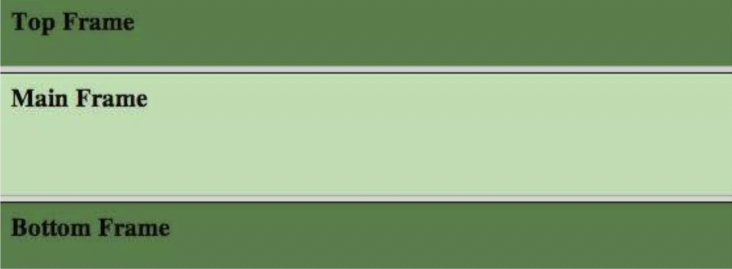
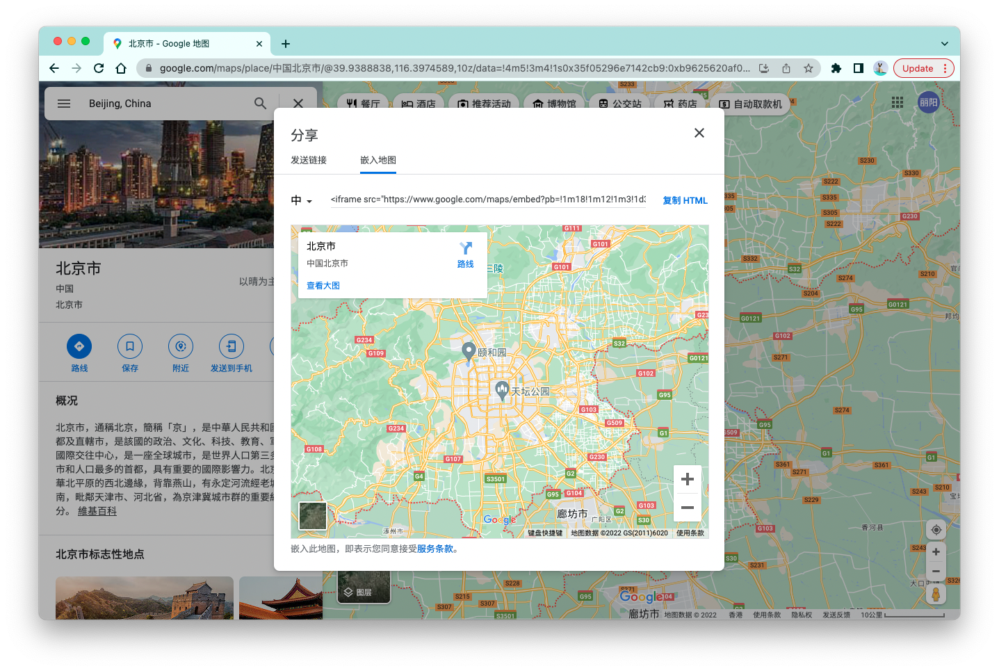

# 《HTML标准》解读：详解Iframe元素

**在HTML中，把在页面中插入的其他HTML页面，称为「frame」。** 

有三种元素可以给页面插入frame，分别是：`iframe`、`object`、`embed`:

```html
<iframe src="example.html" ></iframe>
<object data="example.html" type="text/html"></object>
<embed src="example.html" type="text/html">
```

我们很少使用后面两种方法。一方面，这两种元素的语义是插入其他类型的外部资源/插件，比如PDF，而不是HTML页面。另一方面，相比于iframe，object和embed都缺乏相关的安全特性。比如，如果上面的example.html里面的脚本企图通过`alert()`发起一个弹窗，只有iframe元素提供相关的能力去禁用这个弹窗，具体方法我们会在下面谈到。


<br/>


### 目录:

- [iframe简史](#iframe简史)

- [iframe的基础使用](#iframe的基础使用)

- [iframe的安全考量以及安全特性](#iframe的安全考量以及安全特性)

  * [第三方使用iframe引入你的页面](#第三方使用iframe引入你的页面)

  * [使用iframe引入第三方页面](#使用iframe引入第三方页面)
<br/>


## iframe简史

在90年代，有一个曾经被认为“大有搞头”的标签叫frameset，通过frameset标签，开发者可以给页面嵌入多个frame，这些frame可以像table元素一样在页面中排列，比如：

```html
<frameset rows="10%,80%,10%">
    <frame name="top" src="top_frame.htm">
    <frame name="main" src="main_frame.htm">
    <frame name="bottom" src="bottom_frame.htm">
</frameset>
```

这段代码会给页面插入3个frame，并且按照给定的设置排序：



在那个网速很慢的年代，一些开发者通过这种方式把页面切分成不同的模块，从而优化整体的加载速度；但他的弊端在于，多个frame同时操作主页面，会导致很大的开发与维护成本。于是，随着网络基础设施的升级迭代，framesets标签也被淘汰了，永远停留在了HTML4中。

iframe标签最早被微软引入，在IE浏览器中获得支持，然后被写进了HTML4中。后来的XHTML摈弃了Iframe，想做另一个叫做XFrame的标签。不过我们都知道，XHTML最后没有获得大规模的使用。而HTML5则重新引入了iframe元素。如今，iframe已经成为开发者在页面中插入frame所使用的主要元素。


<br/>


## iframe的基础使用

开发者可以使用`src`或者`srcdoc`声明iframe的内容。`src`表示资源的地址，`srcdoc`则表示一段在iframe中渲染的HTML。

```html
<iframe src="example.html" ></iframe>
<iframe srcdoc="<p>查看<a href=&quot;example.html&quot;>例子</a>."></iframe>
```

使用`srcdoc`属性需要注意的是，它跟其他的HTML属性一样，属性值的双引号`"`以及`&`符号都需要用`&quot;`以及`&amp;`进行转义。

一些网站允许你便捷地使用iframe插入他们的内容，比如谷歌地图。如下图所示那样，复制并粘贴给出的HTML片段，你就可以直接在自己的页面中插入谷歌地图。



你可以通过`iframe.contentWindow`、`iframe.contentDocument`分别访问iframe内的window对象和document对象，iframe内的脚本也可以通过`window.parent`访问主页面的window。不过，这种访问会受到同源策略的限制。当iframe的URL与主页面不是同源的时候，尝试通过上述API互相访问对方的DOM树都会报错。

相比于上述API，开发者更加被推荐使用的是`window.postmessage()`，这个API可以使你安全地在不同的frame之间进行交流。


<br/>


## iframe的安全考量以及安全特性

关于iframe的安全主要有两个方面的考量：

- 第三方使用iframe引入你的页面
- 使用iframe引入第三方页面


<br/>


### 第三方使用iframe引入你的页面

恶意的第三方可以通过iframe引入你的页面，伪造身份，诱导用户点击某些按钮，从而实现点击劫持（click-jacking）。

你可以使用`X-Frame-Options`http头禁止页面在iframe、embed、object中被加载。`X-Frame-Options`只支持两个值：

- `DENY`，表示不允许在任何frame中加载。；
- `SAMEORIGIN`，除了同源站点以外，不允许在其他页面中的frame里加载。

```http
X-Frame-Options: DENY
X-Frame-Options: SAMEORIGIN
```

比如，设置了`DENY`以后，使用iframe引入页面的尝试会报错：`Refused to display 'http://XXX.com' in a frame because it set 'X-Frame-Options' to 'deny'.`


<br/>


### 使用iframe引入第三方页面

有时候，在页面中通过iframe引入不受控制的第三方页面，是危险的。

比如，虽然同源策略对`window.parent`的访问做了很多的限制，但依旧不是密不透风的。即便是非同源站点，iframe里的脚本依旧可以通过`window.parent.location.replace()`触发主页面导航到新的地址。

而iframe能做的事情远不止这些，它还可以触发下载一些恶意文件、给主页面恶意弹窗、又或者打开新的窗口等等：

```html
<!-- 主页面 -->
<iframe src="https://hostile-site.com"></iframe>

<!-- iframe：https://hostile-site.com -->
<!-- 恶意下载 -->
<script>
    const hostileAnchor = document.createElement('a')
    hostileAnchor.href = '/somethingBad'
    hostileAnchor.setAttribute('download', '')
    hostileAnchor.click()
</script>

<!-- 恶意弹窗 -->
<script>alert('点击送福利')</script>

<!-- 恶意导航 -->
<script>window.open('http://hostile-site.com', '_blank')</script>
```

针对这些问题，iframe提供了两个机制实现内容的安全：「沙箱」以及「权限策略」，它们分别可以通过`sandbox`属性以及`allow`属性进行触发与配置。

<br />

#### 沙箱

当声明`sandbox`属性的时候，iframe内的页面会被当作一个独立的源（所以自动触发同源策略的所有约束），页面的表单、脚本、以及一些可能有问题的API都会被禁用，并且只允许触发iframe内的导航：

```html
<!-- 主页面 -->
<iframe src="https://other-site.com" sandbox></iframe>
```

如果你想要在沙箱内启用某一个特定的功能，你需要显式声明这个功能对应的关键词，比如，如果你想要允许iframe使用表单功能，你可以这么设置：

```html
<!-- 主页面 -->
<iframe src="https://other-site.com" sandbox="allow-forms"></iframe>
```

你可以同时启用多个功能，只需要在属性值中使用空格隔开关键词，如`sandbox="allow-same-origin allow-forms"`。所有的关键词我用一张表给你总结了：

| 关键词                                   | 描述                                                         |
| ---------------------------------------- | ------------------------------------------------------------ |
| allow-same-origin                        | 使得iframe内的页面使用其真正的源，而不是被迫当作独立的源。   |
| allow-top-navigation                     | 允许页面在父浏览上下文中导航。                               |
| allow-top-navigation-by-user-activation  | 允许页面在父浏览上下文中导航，但必须是由用户触发。           |
| allow-top-navigation-to-custom-protocols | 允许导航使用`about`, `blob`, `data`, `file`, `http(s)`以外的协议。 |
| allow-forms                              | 允许使用表单。                                               |
| allow-modals                             | 允许弹窗，如`alert()`、`confirm()`、`prompt()`               |
| allow-scripts                            | 允许执行脚本。                                               |
| allow-downloads                          | 允许下载资源。                                               |
| allow-popups                             | 允许在新的窗口打开页面，如`window.open(URL, '_blank')`       |
| allow-popups-to-escape-sandbox           | 允许在新的窗口打开页面，且不继承iframe的沙箱限制。           |
| allow-orientation-lock                   | 允许使用[Screen Orientation API](https://w3c.github.io/screen-orientation/)。 |
| allow-pointer-lock                       | 允许使用[Pointer Lock API](https://w3c.github.io/pointerlock/)。 |
| allow-presentation                       | 允许使用[presentaion API](https://w3c.github.io/presentation-api/)。 |

实际上，在CSP（内容安全策略）中，也有一种类似的机制，使得这种沙箱机制作用于整个页面以及页面内所有的frames。但这种全局的沙箱机制只能在HTTP头声明，不能在meta标签中声明，其格式如下：

```http
Content-Security-Policy: sandbox;
Content-Security-Policy: sandbox <value>;
```

这里的`<value>`与iframe元素的`sandbox`属性接受的值是一样的。

<br />

#### 权限策略

从上面我们看到，沙箱的机制是先禁用所有的功能，再逐个启用，但是这也导致了一些问题：

- 对浏览器中那些默认关闭的功能，没有相应的启动机制。
- 扩展性差。在增加新功能的时候有很大的兼容性风险。

除此之外，沙箱作用的最小颗粒度是一整个frame，他无法做到给特定的站点定制特定的约束，因为在第三方代码里添加的frame是不受主页面控制的。

「权限策略（Permission policy）」就是对沙箱机制这种不足的补充。权限策略的曾用名为「特征策略（Feature policy）」，它的能力不会与沙箱重叠，它们被鼓励配合一起使用。

举一个使用的例子：一般来说，当frame与主页面不同源的时候，frame内的地理位置功能是默认禁止的，但是你可使用`allow`属性启用这个功能，使得frame内可以使用[Geolocation API](https://w3c.github.io/geolocation-api/#permissions-policy)：

```html
<!-- 主页面 -->
<iframe src="https://other-origin.com/map" allow="geolocation"></iframe>

<!-- iframe：https://other-origin.com -->
<script>
    navigator.geolocation.getCurrentPosition(
        (data) => {console.log(data)}, 
        (err) => console.log(err))
</script>
```

与沙箱一样，权限策略也可以在http头中声明全局的权限，具体使用`Permissions-Policy`http头。以下的HTTP头会在同源以及`https://other-origin.com`的frame中启用地理位置功能，其他的站点都会禁用地理位置功能。而这种针对特定的源定制特定的约束正是沙箱机制做不到的地方。

```http
Permissions-Policy: geolocation=(self "https://other-origin.com")
```

而关于权限策略的其他使用，你可以阅读这篇文章：[Controlling browser features with Permissions Policy](https://developer.chrome.com/en/docs/privacy-sandbox/permissions-policy/)

值得注意的是，权限策略目前仍在发展中，它的[规范](https://w3c.github.io/webappsec-permissions-policy/)还处在草案的阶段。而所有权限策略对应的关键词、描述、浏览器兼容性，你可以在这个[github仓库](https://github.com/w3c/webappsec-permissions-policy/blob/main/features.md)中看到。


