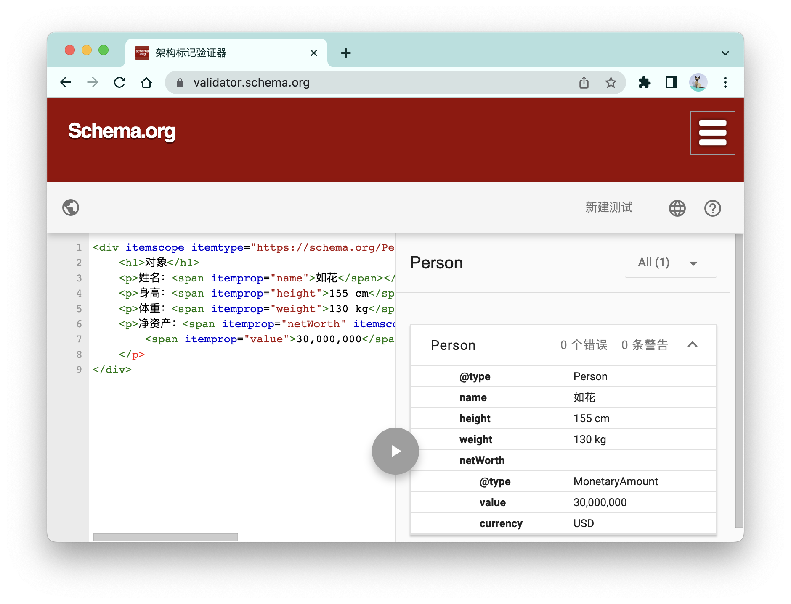

# 一文读懂HTML微数据

关于微数据，我们可以先从一个简单的HTML片段入手：

```HTML
<h1>对象</h1>
```

不同的人看到“对象”有可能会理解成不同的意思：普通人会理解为自己的恋人，程序员为理解为一个编程概念，象棋爱好者会想到棋谱中的两颗棋子。不过，只要有上下文，我们就能消除歧义：

```html
<h1>对象</h1>
<p>姓名：如花</p>
<p>身高：155cm</p>
<p>体重：130kg</p>
```

然而，即便配合上下文，对于机器（如搜索引擎）来说，依旧没有足够的智能推断出这里的对象究竟指的是哪一种意思。这时，就是「微数据」派上用场的地方：

```html
<div itemscope itemtype="https://schema.org/Person">
    <h1>对象</h1>
    <p>姓名：<span itemprop="name">如花</span></p>
    <p>身高：<span itemprop="height">155 cm</span></p>
    <p>体重：<span itemprop="weight">130 kg</span></p>
</div>      
```

在这里：`itemscope`表示这是一个微数据的项，`itemtype`表示这个项的类型，`itemprop`表示这个项的属性。对于这个HTML片段，搜索引擎可以提取出以下的数据：

```json
{
	"@type": "Person",
	"name": "如花",
	"height": "155 cm",
	"weight": "130 kg",
}
```

**这种被提取出来的数据也称为「结构化数据 structured data」。** 有了这些数据，搜索引擎就能准确理解页面的内容，并给页面建立更加精细的分类。以后，别人搜“恐龙”或者“坦克”的时候，你的对象如花就可能就会出现在搜索结果里头了。

<br />

当然，这只是一个玩笑。不过，利用结构化数据除了能提高搜索结果的准确率，还能让搜索的结果以更加有意义的方式呈现。比如，当我在谷歌搜“可乐鸡翅”时，会有这样的结果：


这里每一份食谱的封面、标题、数据都是谷歌通过提取页面内的结构化数据再作呈现的。对于使用者来说，我不仅能够提前看到每一份食谱的评分、视频时长等数据，我甚至还能基于这些维度对食谱进行过滤。

除了食谱以外，基于结构化数据的其他类型的特殊呈现，你可以在这个[谷歌开发文档](https://developers.google.com/search/docs/appearance/structured-data/search-gallery)中看到。


<br/>


### 目录:

- [微数据的使用](#微数据的使用)

  * [itemtype与词汇表](#itemtype与词汇表)

  * [itemprop与属性值的提取规则](#itemprop与属性值的提取规则)

  * [itemid与全局标识符](#itemid与全局标识符)

  * [itemref](#itemref)

- [结构化数据的其他格式](#结构化数据的其他格式)
<br/>


## 微数据的使用

**在微数据模型中，一个页面的结构化数据是由多个「项」组成的；每一个项含有的信息可能包括：项类型、全局标识符以及多个属性。** （微数据中的“属性”与HTML的“属性”是两个不同的概念，为了在本文进行区分，HTML的“属性”都会使用「HTML属性」命名，微数据的“属性”会继续使用「属性」）

与微数据相关的所有HTML属性如下所示，它们属于全局HTML属性，是所有元素都共享的：

- `itemscope`：创建一个新的项。
- `itemtype`：定义项类型。
- `itemprop`：添加一个属性到项中。
- `itemid`：声明项的全局标识符。
- `itemref`：关联不在项元素子代的属性。

<br />

一个属性的值即可以是一个字符串，也可以是一个新的项。如以下这个例子，“净资产”一栏就是嵌套的项。

```html
<div itemscope itemtype="https://schema.org/Person">
    <h1>对象</h1>
  	<p>姓名：<span itemprop="name">如花</span></p>
    <p>身高：<span itemprop="height">155 cm</span></p>
    <p>体重：<span itemprop="weight">130 kg</span></p>
    <p>净资产：<span itemprop="netWorth" itemscope itemtype="https://schema.org/MonetaryAmount">
        <span itemprop="value">30,000,000</span> <span itemprop="currency">USD</span>
    </p>
</div> 
```


<br/>


### itemtype与词汇表

在开篇的例子中我们可以看出，结构化数据是给机器而不是人类阅读的。因此，我们必须使用机器能够理解的“词汇”。一些社区会制定各种各样的「词汇表（vocabularies）」，规范在结构化数据中描述不同事物的不同方面的用词，**这些词汇表就是开发者与搜索引擎对于描述事物用词的协议。** 一张词汇表通常会带有以下信息：

- 词汇表所描述内容的范围。比如有的词汇表是用来描述人的，有的词汇表用来描述一个事件的。
- 词汇表的权威URL，这个URL会用在`itemtype`上，表明一个项所使用的词汇表。
- 词汇表的属性列表，包括每一个属性的命名、预期类型、具体含义，这些属性会用在`itemprop `上；
- 词汇表的全局标识符，只有特定的词汇表才支持全局标识符，对应`itemid`，具体会在[后面](#itemid与全局标识符)讲到。

以一张上面例子中用到的词汇表[Person](https://schema.org/Person)为例，下面截取了这张词汇表中我们使用到的部分：

> Person:
>
> 描述：一个人（活的、死的、不死的、虚构的）。
>
> 权威URL：https://schema.org/Person。
>
> | 属性(Property) | 预期类型(Expected Type)                                      | 描述(Description)（简化版本） |
> | -------------- | ------------------------------------------------------------ | ----------------------------- |
> | name           | 文本                                                         | 表示该项的名字。              |
> | weight         | [可量化的值](https://schema.org/QuantitativeValue)           | 表示该项的重量。              |
> | height         | [距离](https://schema.org/Distance)/可量化的值               | 表示该项的高度。              |
> | netWorth       | [金钱数量](https://schema.org/MonetaryAmount)/[价格的值](https://schema.org/PriceSpecification) | 一个人的资产减去负债。        |
> | ...            | ...                                                          | ...                           |

在预期类型中，可量化的值、距离、金钱数量、价格的值，都是进一步细分的词汇表。出于简洁的原因，我在上面例子中的身高、体重属性并没有使用嵌套的项。

比较有名的词汇表集合是[Schema.org](https://schema.org/)，它是由各大知名的搜索引擎共同开发并实际应用的。我在上面的例子中，就是使用了两张里面的词汇表：[Person](https://schema.org/Person)以及[金钱数量](https://schema.org/MonetaryAmount)。

当你使用[Schema.org](https://schema.org/)的词汇表，你可以通过它提供[语法检查工具](https://validator.schema.org/)，查看你页面中的微数据语法是否合法，以及提取出来的结构化数据。


<br/>


### itemprop与属性值的提取规则

一般来说，微数据属性会提取元素后代的文本内容作为它的值，比如下面这个name属性，值为“如花”。

```html
<p>姓名：<span itemprop="name">如花</span></p>
```

但是对于一些特殊的元素，值的提取会使用其他的规则，比如下面例子的image属性，会提取HTML属性`src`作为它的值；而url属性，会提取HTML属性`href`作为它的值。

```html
<p>
<p><a itemprop="url" href="https://XXX.com/page">个人主页</a>
```

所有的特殊情况如下所示：

- 如果元素有HTML属性`itemscope`，会创建一个新的项。
- 对于`meta`元素，会使用HTML属性`content`作为值。
- 对于`audio`、`embed`、`iframe`、`img`、 `source`、 `track `、`video`元素，会使用HTML属性`src`作为值。
- 对于`a`、`area`、`link`元素，会使用HTML属性 `href`作为值。。
- 对于`object`元素，会使用HTML属性`data`作为值。
- 对于`data`、`meta`元素，会使用HTML属性`value`作为值。
- 对于`time`元素，会使用它的`datatime`作为值。

更多的细节可以查看标准[关于微数据值的处理模型](https://html.spec.whatwg.org/multipage/microdata.html#values)。


<br/>


### itemid与全局标识符

在这个世界上，有一些事物是有自己独一无二的标识的。比如每一本正规出版的书籍，都会有自己对应的isbn号码，无论在任何场景下，使用这个isbn号码就能毫无偏差地指代这一本书。所以，可以说isbn号码就是一本书的“全局标识符”

如果一张词汇表描述的事物也具有类似这样“全局标识符”的特点，那这张词汇表也许就支持全局标识符（具体取决于词汇表的定义）。在微数据中，全局标识符使用HTML属性`itemid`表示。比如以下的例子中，使用`itemid`表明这个项在谈论一本特定的书：

```html
<dl itemscope
    itemtype="https://vocab.example.net/book"
    itemid="urn:isbn:9789574706396">
 <dt>标题
 <dd itemprop="title">會撒嬌的女人最好命
 <dt>作者
 <dd itemprop="author">羅夫曼
</dl>
```

需要注意的，带有HTML属性`itemid`的元素必须同时带有HTML属性`itemtype`与`itemscope`，且不应该在不支持全局标识符的词汇表中使用`itemid`  。


<br/>


### itemref

`itemref` 用于关联那些不在项元素子代的属性，`itemref`会爬取页面内对应`id`的元素，把这些元素内的微数据属性添加到项中。如以下例子，a属性会被添加到项中。

```html
<div id="x">
 <p itemprop="a">1</p>
</div>
<div itemscope itemref="x">
 <p itemprop="b">2</p>
</div>
```

`itemref`常用在不方便把属性放在项元素子代的情况。


<br/>


## 结构化数据的其他格式

微数据只是搜索引擎可用于提取页面中结构化数据的其中一种格式，其他常用的格式还包括：

- JSON-LD：使用一个json直接表示页面中的结构化数据，在一个`type="application/ld+json"`的script标签中声明。如：

  ```html
  <script type="application/ld+json">
  {
    "@context": "https://schema.org",
    "@type": "Person",
  	"identifier": "对象",
    "height": "155 cm",
    "weight": "130 kg"
  }
  </script>
  ```

- RDFa：使用XML相关属性表示页面中的结构化数据。如：

  ```html
  <div vocab="https://schema.org/" typeof="Person">
      <h1 property="identifier">对象</h1>
      <p>身高：<span property="height">155 cm</span></p>
      <p>体重：<span property="weight">130 kg</span></p>
  </div>   
  ```

- Microformat：使用HTML属性`class`表示页面中的结构化数据。

<br />

根据谷歌的[开发文档](https://developers.google.com/search/docs/appearance/structured-data/intro-structured-data#structured-data-format)，谷歌搜索支持*JSON-LD*、*微数据* 以及 *RDFa* 这3种格式，但推荐开发者使用JSON-LD，大概是因为JSON-LD是最简洁的。幸运的是，这三种格式所使用的词汇表大多都是共享的，比如每一张Schema.org的词汇表都可以同时编码成这三种格式，且每张词汇表的[下面](https://schema.org/Person#eg-0001)都给我们列举了同一结构化数据下这3种格式的例子。

