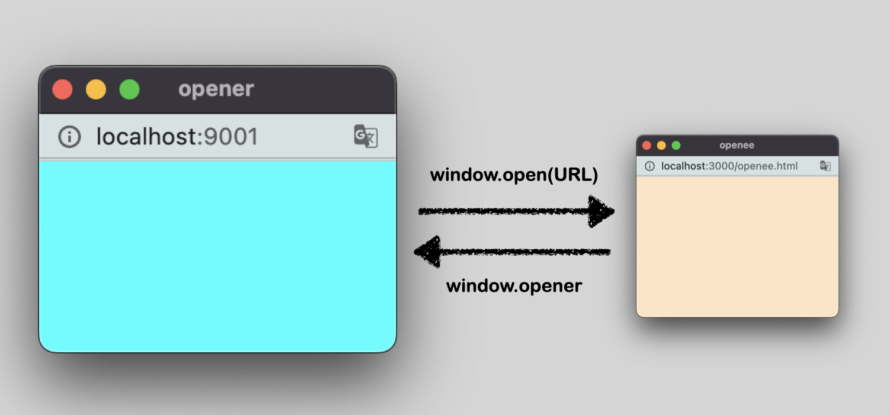
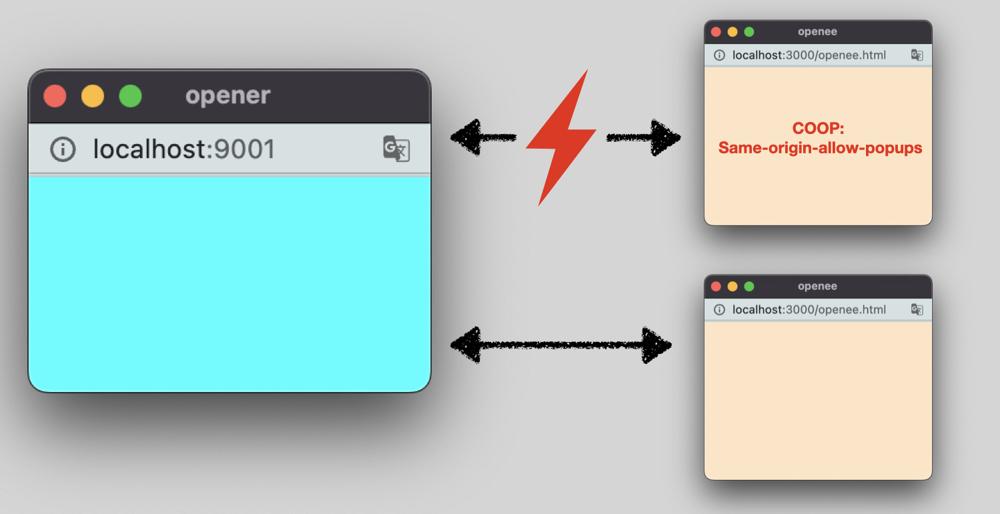
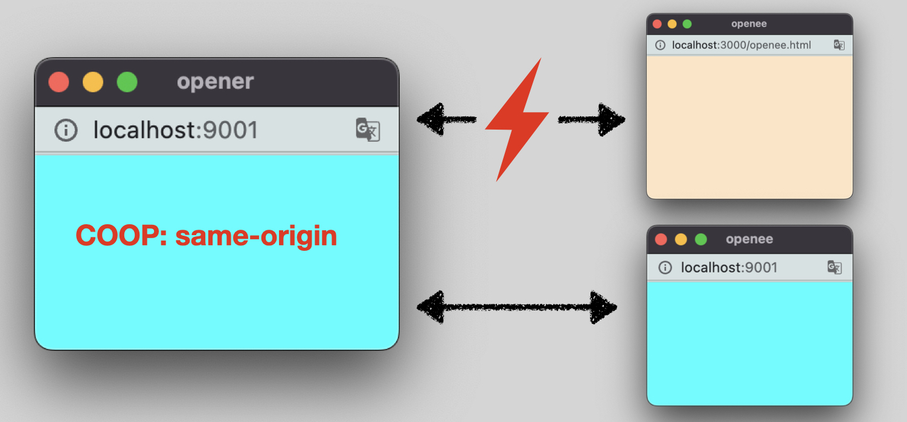
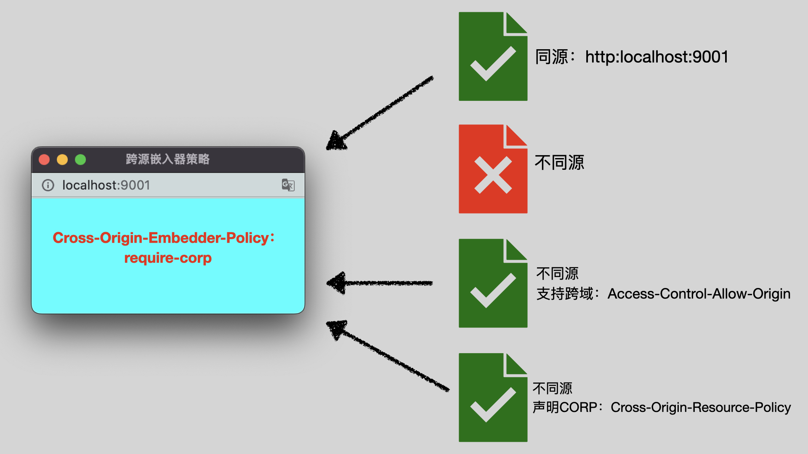

# HTML页面安全策略汇总(1)：同源策略、CORS、COOP、COEP

**在所有浏览器的安全策略中，同源策略是最基础、最核心的策略，很多其他衍生出来的策略都只是同源策略的“补丁”，包括本文提到的其他安全策略：CORS、COOP、COEP。** 

两个URL，只有在协议、域名、端口都相同的情况下才算是“同源”，对于不同源（以下称为“跨源”）的页面或者资源，同源策略会在以下层面给他们施加约束：

1. **js APIs的访问限制**：有时候，我们可以通过`window.contentWindow`、`window.parent`、`window.opener`、`window.top`访问其他页面的window对象。但是当window对象指向页面是跨源的时候，该window对象的绝大部分的属性/方法是不可访问的。

   比如，尝试使用`window.document`访问跨源页面的DOM会报错：

   > ❌：Uncaught DOMException: Blocked a frame with origin "https://XXX.com" from accessing a cross-origin frame.

   在跨源window对象上允许使用的为数不多的几个方法中，最有用的是`window.postMessage()`，这个方法允许你在跨源windows之间安全地进行交流。

2. **数据隔离**：对于indexedDB以及localStorage/sessionStroage，不同的源是使用一个独立的存储空间的，且这个存储空间是无法被跨源的js代码直接读取的。

3. **外部资源的读取**：在页面中请求跨源资源时，如果没有使用CORS，那么拿到的资源称为「不透明资源」。**不透明资源可以被页面嵌入，但不能使用脚本读取。** 具体的几个例子是：

   - 跨源的图片可以正常插入到页面中，但是无法使用`canvas.getImageData()`或`toDataURL()`读取具体的像素数据。
   - 跨源的样式表可以正常插入到页面中，但是无法使用`document.styleSheets[n].cssRules`访问具体的样式规则。
   - 跨源的js脚本可以正常插入到页面中，但是无法使用`window.onerror`访问它的报错。


<br/>


### 目录:

- [不透明资源的问题](#不透明资源的问题)

- [COOP：跨源打开程序策略](#coop跨源打开程序策略)

- [COEP：跨源嵌入器策略](#coep跨源嵌入器策略)

- [使用COOP与COEP实现跨源隔离](#使用coop与coep实现跨源隔离)
<br/>


## 不透明资源的问题

不透明资源虽然对跨源资源的安全提供了保障，但是在实践的过程中还是遇到了一些问题：

1. 灵活性问题。比如，当你把不同的资源部署在不同的域名上，基于同源策略，你便无法正常使用脚本读取这些属于自己的资源。为了应对这个问题，浏览器提供了CORS，跨源资源共享。对于CORS的使用，网络上已经提供了很多的[教程](https://developer.mozilla.org/en-US/docs/Web/HTTP/CORS)，而我对这些教程普遍缺失的部分：HTML元素的crossorigin属性，进行了[补充](./2.5.md)。
2. [幽灵漏洞](https://zh.m.wikipedia.org/zh-hant/%E5%B9%BD%E7%81%B5%E6%BC%8F%E6%B4%9E)出现。黑客通过精确计算具体操作所花费的时间，可以预测数据的内容，使用这种攻击方式，黑客可以直接读取跨源图片的像素数据，使得“不透明”的保护机制失效。[为了应对这个问题](https://www.mozilla.org/en-US/security/advisories/mfsa2018-01/)，浏览器不得不把`performance.now()`的精度调低，，并且禁用了可能存在安全风险的相关功能，如`sharedArrayBuffer`。**如果你想要重新启用这些功能，需要让页面进入一个浏览器认为相对安全的环境，这个环境也称之为「跨源隔离模式」，具体的做法，就是声明下面所讲到的COOP、COEP安全策略**。


<br/>


## COOP：跨源打开程序策略

当我们在A页面使用`window.open(URL)`打开B页面的时候，B页面会在一个新的浏览器标签中打开。这个时候，A页面称为「opener」，B页面称为「openee」。A页面与B页面会有一层连接：

- 在A页面中，`window.open(URL)`会返回B页面的window，且该window对象的`closed`属性为false，意味着你可以使用`window.close()`等方法关闭B页面。
- B页面可以通过`window.opener`访问A页面中的window。



使用COOP(Cross-Origin-Opener-Policy)，你可以“切断”两个页面的这层window连接，从而使得： 

- 在A页面中，B页面window对象的`closed`属性为true，所以无法调用B页面window对象上的任何方法。
- B页面访问`window.opener`返回null。

COOP具体的使用方式是声明`Cross-Origin-Opener-Policy`HTTP头：

```http
Cross-Origin-Opener-Policy: same-origin
```

`Cross-Origin-Opener-Policy`可以有三个值：

- "unsafe-none"：这是默认值，使用默认的行为。 

- "same-origin-allow-popups"：当openee页面声明这个值，且两个页面不同源，就会切断window连接。

  

- "same-origin"：不管是opener还是openee声明这个值，只要两个页面不同源，就会切断window连接。

  

<br />

一种与COOP类似的能力是noopener。比如，对于超链接元素，使用`rel=noopener`表示要切断与打开的页面之间的window连接，如：

```html
<a href="https://www.example.com" rel="noopener">一个链接</a>
```

**但是noopener与COOP的区别在与：noopener只能在打开页面（opener）上施加影响，当你的页面是作为openee被打开时，你无法切断window连接**，而COOP就可以做得到，只需要简单声明以下HTTP头即可：

```http
Cross-Origin-Opener-Policy: same-origin-allow-popups
```


<br/>


## COEP：跨源嵌入器策略

COEP全称Cross-origin embedder policies，跨源嵌入器策略，可以控制引入非同源资源的时候是否需要经过资源所有者的“显式准许”。



使用以下的HTTP头可以声明COEP策略：

```http
Cross-Origin-Embedder-Policy: require-corp
```

资源所有者有两种方法可以显式准许资源被加载：

1. 对资源做了CORS的支持。比如：

   ```
   ----- 服务端支持 ------
   Access-Control-Allow-Origin：https://my-site.com
   
   ----- 客户端使用 -----
   
   ```

2. 声明了`Cross-Origin-Resource-Policy`HTTP头。`Cross-Origin-Resource-Policy`可以有三种值：

   - cross-origin：表示资源可以被跨源的页面引入。
   - same-site：表示资源可以被同一站点引入。
   - same-origin：表示资源只能被同源的页面引入。


<br/>


## 使用COOP与COEP实现跨源隔离

当页面的同时声明以下HTTP头时，会被认为启用“跨源隔离模式”：

```http
Cross-Origin-Embedder-Policy: require-corp
Cross-Origin-Opener-Policy: same-origin
```

你可以使用`self.crossOriginIsolated`查看页面是否进入跨源隔离模式。当页面进入跨源隔离的时候，浏览器认为进入了安全的环境，所以会解锁以下的能力：

- `performance.now()`、`performance.timeOrigin`获得更高的精度
- 可以使用`SharedArrayBuffer`
- 可以使用`performance.measureUserAgentSpecificMemory()`方法
- 禁止修改`document.domain`


