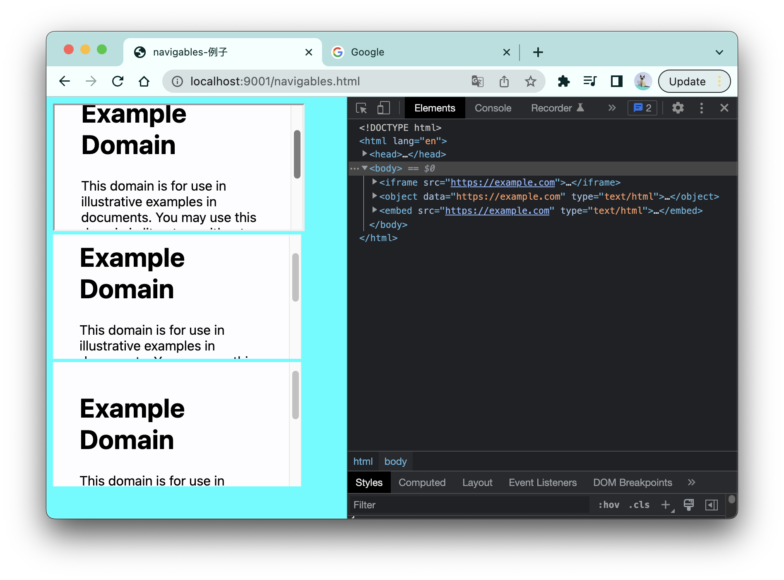
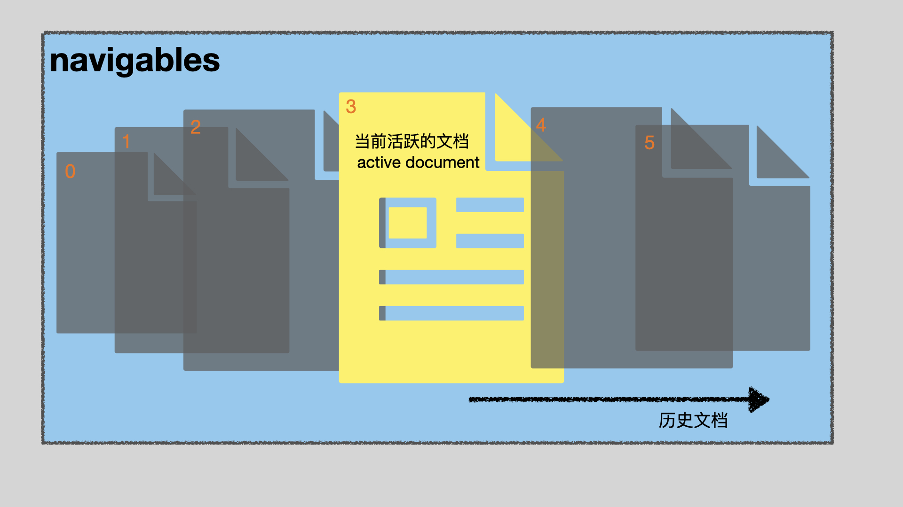
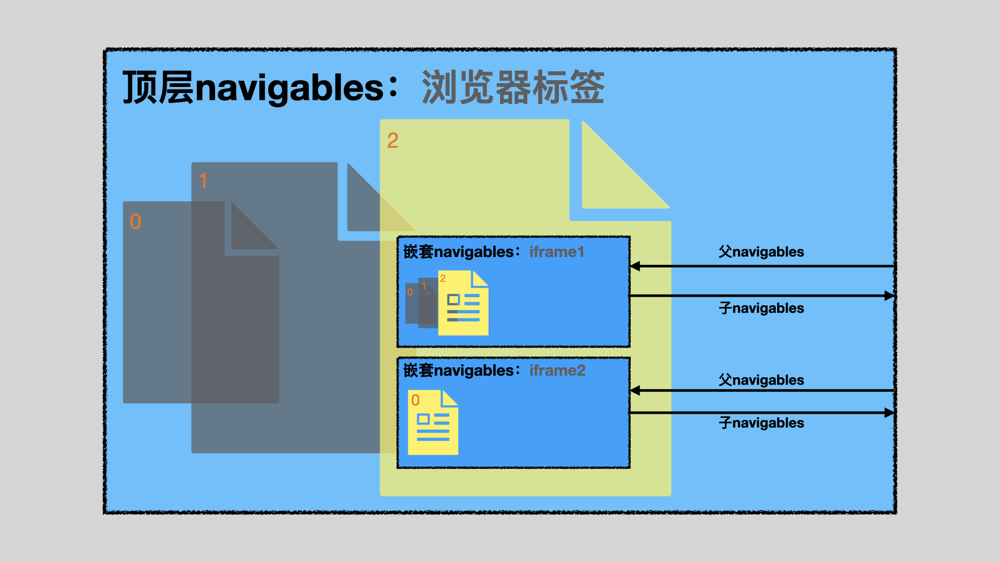
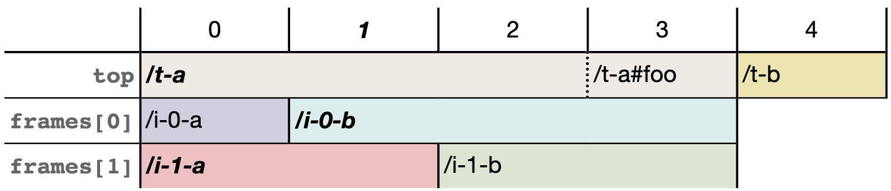

# 浏览器的页面管理机制：navigables

一个HTML文档可以在浏览器中的不同的地方加载。包括：

- 浏览器窗口、浏览器标签；
- iframe、obejct、embed元素内。



我们暂且把这些可以加载页面的地方称为“HTML文档的容器“，这些“容器”都有两个特点：

1. 每个“容器”在自己生命周期内都可以加载不止一个HTML文档；
2. 一个“容器”自身又可以嵌套其他的”容器“，如iframe里的页面又可以继续嵌套其他的iframe。

正是这些特点，导致管理这些”容器“以及“容器”内的页面变得复杂，具体表现在以下方面：

- **容器选择**：当要导航到一个新的页面时，如何在众多“容器”中精准选择其中一个来加载该页面。比如，如果页面中有一个iframe，要想使用`window.open(URL)`方法在iframe内打开一个页面，该如何做到？
- **历史导航顺序**：不同的“容器”可以有自己的页面历史。然而纵使一个页面有再多嵌套的“容器”，浏览器UI也只提供一对历史导航按钮（一个前进按钮与一个后退按钮）。于是，如何用一对历史导航按钮合理地、有序地在多个“容器”中切换历史页面，是一个重要的问题；它不仅影响历史导航按钮的使用，还会影响页面中history API的行为。
- **安全考量**：一些“容器”之间的页面可以通过索引进行互相访问，比如通过window.opener、window.parent，这里又有哪些安全问题需要考虑？

因此，管理这些”容器“、“容器”内的页面、“容器”之间的关系成为HTML标准的一个重要课题。**在HTML标准中，把所有这些可以承载HTML页面的“容器”命名为「Navigables」。** 本文将会先讲解这一个概念，然后再针对上面列出的3个层面逐一进行讨论，最终带你吃透这个概念。


<br/>


### 目录:

- [Navigables](#navigables)

- [在指定的navigables中打开页面：target关键词](#在指定的navigables中打开页面target关键词)

- [历史导航顺序：Traversable navigables](#历史导航顺序traversable-navigables)

- [安全考量](#安全考量)
<br/>


## Navigables

一个navigables代表一连串有顺序的页面，其中有且只有一个页面是激活的，称为活跃的页面/文档（active document）。使用navigables可以在这些页面之间进行来回跳转（即切换活跃的页面）。反过来看，每一个HTML页面，不管是否处于活跃状态，也有自己所归属的navigables。



在一张HTML页面中，iframe、object、embed元素创建的navigables称为**嵌套navigables**；此时，页面所在的navigables为这些元素创建的navigables的**父navigables**，反过来，这些元素创建的navigables为页面所在的navigables的**子navigables**。如果一个navigables没有父navigables，那这个navigables也称为**顶层navigables**，一个浏览器标签创建的navigables一定是顶层navigables。

如果你觉得上面这段话有点绕，可以配合下图理清他们的关系：



你或许会觉得navigables跟「浏览上下文」的概念很相似，你的感觉完全没有错。navigables是[从原来的「浏览上下文」中分解出来的概念](https://github.com/whatwg/html/commit/0a97a81da77bc4cb0ab5b16420605ca001ff5b17)，它接替了原来浏览上下文导航部分的功能，使得浏览上下文的功能更单一。[根据HTML标准](https://html.spec.whatwg.org/multipage/document-sequences.html#infrastructure-for-sequences-of-documents)：navigables是面向用户的概念，主要负责页面之间的导航管理；而浏览上下文是面向开发者的概念，主要负责一些安全问题。

正由于navigables是一个非常新鲜的概念（2022年10月31日进入标准，在撰写本文的时候，甚至MDN还没有相关文档），没有一个统一的中文翻译，所以在这里我就直接使用它的英文命名。


<br/>


## 在指定的navigables中打开页面：target关键词

在HTML页面中导航到一个新的页面，主要有两种方式：

- 使用超链接元素：如`a`、`area`、`form`；
- 使用js脚本：如`window.open()` 、 `document.open()`。

不管是哪种方式，都可以通过**声明target关键词**让新的页面在指定的navigables中打开。比如下面的这个例子，点击a标签后页面会在新的浏览器标签（即一个顶层navigables）中打开：

```html
<a href="https://www.example.com" target="_blank">在顶层navigables中打开</a>
```

不同的API声明`target`关键词的方式，我为你总结如下表所示：

| API                                  | 声明target关键词的方式                                       | target默认值 |
| ------------------------------------ | ------------------------------------------------------------ | ------------ |
| 超链接元素：`a`、`area`              | 使用`target`属性声明                                         | `_self`      |
| 表单元素：`form`                     | 使用`target`属性声明，而`form`元素内不同的控件可以使用`formtarget`属性声明。 | `_self`      |
| `window.open(url, target, feature)`  | 在`target`参数上声明。                                       | `_blank`     |
| `document.open(url, target,feature)` | `document.open()`的行为比较奇怪，当使用2个或以下的参数，会使得当前document进入写入模式；当使用3个参数，表现与`window.open()`一致。 | `_blank`     |

依据`target`的值，这些API都会遵循以下选择navigables的方式：

- 如果没有指代`target`，则使用target的默认值。
- 如果`target`匹配任何以下的关键词：
  - `_self`：选择当前页面所在的navigables；
  - `_top`：选择当前navigables对应的顶层navigables，如果没有的话就使用`_self`；
  - `_parent`：选择当前navigables对应的父navigables，如果没有的话就使用`_self`；
  - `_blank`：新建一个顶层navigables，选择这个navigables；
- 如果没有匹配任何关键词，表明`target`可能指代的是一个自定义名称的navigables：
  - 查看当前navigables关联的其他navigables中，是否有相同名称的navigables，如果有的话，选择这个navigables；
  - 如果没有的话，创建一个新的navigables，把这个navigables命名为`target`，并选择这个navigables。

每个navigables可以有自己的自定义名称，具体有两种命名方式：

- 在iframe上使用`name`属性，会给iframe创建的嵌套navigables命名。
- 当你使用`window.open(url, target)`打开一个新的页面的后，如果`target`参数不为空且不匹配任何现有的navigables的名称，就会创建一个以`target`为名称的navigables。

<br />

于是，如果页面中有一个iframe，我想在页面中使用`window.open(URL)`在iframe内打开一个页面，只需要这么做即可：

```html
<iframe name="my-navigables"></iframe>
<script>window.open('https://www.example.com', "my-navigables")</script>
```

你可以使用base元素设置默认的target关键词，这样，a元素、area元素、form元素打开的页面都会默认使用该关键词：

```html
<head>
    <base target="my-navigables">
</head>
<body>
    <iframe name="my-navigables"></iframe>
    <!-- 点击下列标签都会在iframe中打开 -->
    <a href="https://www.example.com">example</a>
    <a href="https://www.example1.com">example2</a>
    <a href="https://www.example2.com">example3</a>
</body>
```

<br />

当然，这里还是有一些edge cases的。比如，如果对应的navigables有一些安全限制的话，可能就会导致导航失败。完整的选择navigables的过程，可以阅读[HTML标准选择navigables的算法](https://html.spec.whatwg.org/multipage/document-sequences.html#navigable-target-names)。


<br/>


## 历史导航顺序：Traversable navigables

Traversable navigables是一种特殊的navigables，它会把所有子代navigables的文档历史按照时间顺序合并成一条线性的历史记录，这条历史记录也称为「会话历史（session history）」。这个会话历史会暴露给浏览器UI上的历史导航按钮以及history API，供它们操作。

每一个顶层navigables都是Traversable navigables。

当会话历史包含多个navigables的历史时，使用纯语言来描述该会话历史是一件很吃力的事情，但我们可以借助[Jake图表](https://html.spec.whatwg.org/multipage/document-sequences.html#jake-diagrams)把会话历史可视化，如下所示：



jake图表的基本阅读方式如下：

- 第一行表示会话历史的位置(step)，你可以通过历史导航按钮或者history API在这些位置上来回移动，切换不同的活跃文档。加粗的数字表示当前会话历史所处的位置，比如该图中当前所处的历史位置为1。
- 第一列表示Traversable navigables关联的所有navigables。比如这里一共有3个navigables，一个顶层navigables(top)以及两个嵌套navigables(frames[0]、frames[1])。
- 有颜色的方格表示对应的会话历史位置中，该navigables的文档；方格里内容表示文档的URL，除非是跨源文档，否则一般使用相对URL节省空间。加粗的URL表示在当前会话历史的位置中，每个navigables的活跃文档。在该图里，当前的历史位置为1，在该位置里，顶层navigables的活跃文档为/t-a，两个嵌套navigables的活跃文档分别为/i-0-b、/i-1-a。
- 对于空白的空格，表示在该位置的navigables不存在。

于是，在上面的jake图表表示了以下的过程：

0. 创建一个顶层navigables，打开URL为/t-a的页面，该页面有两个嵌套navigables，URL分别为/i-0-a以及/i-1-a。
1. 第一个嵌套navigables导航到另一个页面，URL为/i-0-b。
2. 第二个嵌套navigables导航到另一个页面，URL为/i-1-b。
3. 顶层navigables使用页面内的片段导航，更新URL至/t-a#foo。
4. 顶层navigables导航到其他的页面，URL为/t-b，在该位置上，两个嵌套navigables没有对应的文档。
5. 使用脚本`history.go(-3)`，返回到会话历史的位置1。（也可以是通过浏览器导航按钮实现）

有了Jake图表，相信你对浏览器如何管理多个navigables之间的历史记录有了更加深刻的理解。


<br/>


## 安全考量

有时候，navigables之间活跃文档可以相互关联，主要有两种关联形式：

1. 在当前页面中使用`window.open()`方法在另一个navigables中打开一个新的页面，新的页面可以通过`window.opener`访问当前页面。

2. 嵌套navigables的活跃文档可以通过`window.parent`、`window.top`访问其祖先navigables的活跃文档。

这两种关联，一方面提供了操作上的灵活性，另一方面也可能会带来一些安全隐患。

对于第一种关联，如果你想要切断这层连接，有两个方法：

- 声明noopener策略，具体的方法是：
  - `window.open(url,target,feature)`：使用feature参数进行声明，值可以是`noopener`或`noreferrer`。
  - form、a、area元素通过`rel`属性来进行声明，值可以是`noopener`或`noreferrer`。

- 声明COOP策略，详见我的另一篇文章[COOP](./7.1.1.md#coop跨源打开程序策略)：

  ```http
  Cross-Origin-Opener-Policy: same-origin
  ```

对于第二种关联，有很多种安全策略都可以限制他们的能力，具体的内容我已经在下面的两篇文章中进行了详细的展开：

- [web页面安全策略汇总(1)](./7.1.1.md)
- [web页面安全策略汇总(2)](./7.1.2.md)

