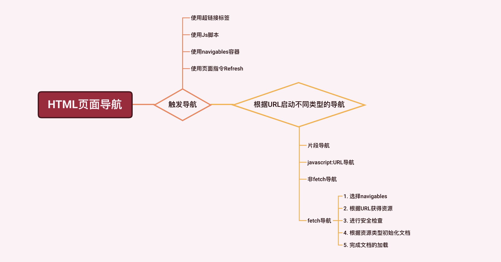
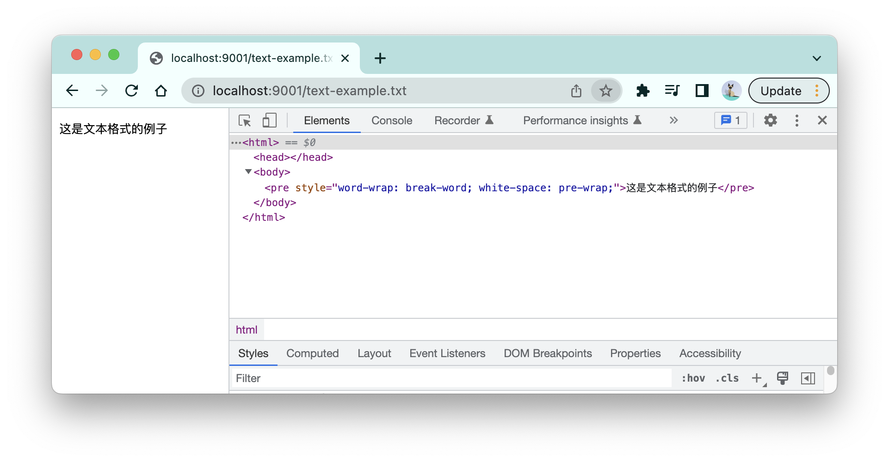

# 浏览器导航全过程

在一个HTML页面中，有以下几种方式可以触发新的页面导航：

- **使用超链接标签**：包括a、area、form标签：

  ```html
  <a href="https://www.example.com"></a>
  ```
- **使用js脚本**：包括location API、`window.open()`、`document.open()`：

  ```js
  window.open("https://www.example.com")
  ```
- **使用navigables容器**：包括iframe、object、embed元素：

  ```html
  <iframe src="https://www.example.com"></iframe>
  ```
- **使用页面指令`Refresh`** ：通过http头或者meta标签声明：

  ```http
  Refresh: 5; url=https://www.example.com/
  ```
  
  ```html
  <meta http-equiv="refresh" content="5; url=https://example.com/">
  ```

尽管触发导航的方式多种多样，但是它们随后使用的导航过程都是一样的，这个过程中最重要的环节我用一张图为你总结：



本文的主要内容依赖标准中的[导航启动算法](https://html.spec.whatwg.org/multipage/browsing-the-web.html#beginning-navigation)以及它的相关子算法，这些子算法都会在本文对应内容的地方列出。


<br/>


### 目录:

- [根据不同的URL启动不同的导航过程](#根据不同的url启动不同的导航过程)

  * [片段导航](#片段导航)

  * [javascript:URL导航](#javascripturl导航)

  * [非fetch导航](#非fetch导航)

  * [fetch导航](#fetch导航)

- [fetch导航的过程](#fetch导航的过程)

  * [1. 选择navigables](#1-选择navigables)

  * [2. 根据URL获得资源](#2-根据url获得资源)

  * [3. 进行安全检查](#3-进行安全检查)

  * [4. 根据资源类型初始化文档](#4-根据资源类型初始化文档)

  * [5. 完成文档的加载](#5-完成文档的加载)
<br/>


## 根据不同的URL启动不同的导航过程

每一种触发导航的方式，都必须声明导航使用的「目标URL」。根据不同类型的URL，将会启动不同的导航过程，具体可以分为以下四种：

- **片段导航(fragment navigation)** ：当目标URL与当前页面URL除了片段部分（以`#`开头的部分）以外都一样的时候，就会触发这个导航过程；
- **javascript:URL的导航**：当目标URL以`javascript:`开头时触发的导航；
- **fetch导航**：当目标URL的协议名为`about`、`data`、`blob`、`file`、`http`、`https`其中之一时所触发的导航，这是我们最常用的导航过程。
- **非fetch导航**：除了以上的协议名之外的导航。


<br/>


### 片段导航

片段导航常用于页面内的跳转。比如在下面的例子中，点击a标签就会跳转到对应的标题上：

```html
<h1 id="heading1">标题1</h1>
<p>...</p>
<h2>标题2</h2>
<p>...</p>
<p><a href="#heading1">跳转到标题1</a></p>
```

因此，片段导航常用在长页面的目录上，比如[HTML标准的目录](https://html.spec.whatwg.org/#toc-introduction)。

片段导航的另一个常用的地方是单页面应用，比如[vue的哈希路由](https://router.vuejs.org/zh/guide/essentials/history-mode.html#hash-%E6%A8%A1%E5%BC%8F)，利用哈希片段不会触发真正页面跳转的特点，从而把页面切换的控制权转移到js脚本上。

关于片段导航的详细过程可以阅读[HTML标准片段导航算法](https://html.spec.whatwg.org/multipage/browsing-the-web.html#scroll-to-fragid)。


<br/>


### javascript:URL导航

该导航会把`javascript:`后面的部分作为js脚本执行，比如点击以下的a标签会触发一个警告弹窗：

```html
<a href="javascript:alert('Warning!!!')">点我触发警告</a>
```

一种常见的javascript:URL是`javascript:void(0)`，这个URL会返回一个undefined，开发者常常使用这种方法来创建一个死链接：

```html
<a href="javascript:void(0)">点我无反应</a>
```

关于javascript:URL导航的详细过程可以阅读[标准中对应的算法](https://html.spec.whatwg.org/multipage/browsing-the-web.html#the-javascript:-url-special-case)。


<br/>


### 非fetch导航

该类导航会交由外部的软件进行处理。比如使用`mailto`协议名，会启用本地的发送email的软件：

```html
<form action="mailto:cxz40901993@gmail.com">
    <button type="submit">发送邮件</button>
</form>
```

除此以外，很多手机端的app跳转，如微信支付功能的实现，使用的都是这个导航过程。

关于非fetch导航的详细过程可以阅读[HTML标准中的非fetch导航算法](https://html.spec.whatwg.org/multipage/browsing-the-web.html#non-fetch-schemes-and-external-software)。


<br/>


### fetch导航

协议名为`about`、`data`、`blob`、`file`、`http`、`https`的URL都会触发fetch导航，**fetch导航与上述的其他导航过程最大的不同是：fetch导航的预期结果是加载一个新的HTML或XML页面。** 

比如，导航到`about:blank`会打开一个空页面，该页面有最基础的HTML元素：

```html
<html>
  <head></head>
  <body></body>
</html>
```

使用`data`协议的URL可以写“字面量HTML“。比如：导航到以下的URL会生成一个带有红点的html页面：

```
data:image/png;base64,iVBORw0KGgoAAAANSUhEUgAAAAUAAAAFCAYAAACNbyblAAAAHElEQVQI12P4//8/w38GIAXDIBKE0DHxgljNBAAO9TXL0Y4OHwAAAABJRU5ErkJggg==
```

`blob`协议的URL主要是用在object URL上。比如你可以使用`URL.createObjectURL(File)`给文件创建一个object URL。

使用`file`协议的URL会获取本地文件，然后加载到浏览器页面上。

而`http`、`https`则是我们最熟悉的协议，当使用http(s)的URL导航时，会发起一个http请求，然后把返回的资源加载到浏览器页面上。

<br />

因为fetch导航是这4种导航中最常用、最重要的一种，因此余下的内容关注的都是fetch导航。


<br/>


## fetch导航的过程

一个完整的fetch导航过程如下：

1. **选择navigables**
2. **根据URL获得资源**
3. **进行安全检查**
4. **根据资源类型初始化文档**
5. **完成文档的加载**


<br/>


### 1. 选择navigables

这个过程会选择新的页面加载的地方，比如在一个新的浏览器标签或者iframe内。

每一种触发导航的方式都会有自己默认选择的navigables，比如使用`window.open(URL)`会默认在新的浏览器标签中打开页面；但你也可以通过一些配置修改这个默认值，比如使用`window.open(URL，'_top')`会使得页面在当前标签中打开。

navigables是从浏览上下文分解出来的概念，navigables的理解、选择navigables的过程以及相关的注意事项我在[浏览器的页面管理机制：navigables](./7.3.md)进行了详细的讲述。


<br/>


### 2. 根据URL获得资源

浏览器会根据URL获得相应的资源，不管是通过解析(`data`协议)，还是在本地获取（`file`协议），又或者是发起HTTP请求（`http(s)`协议）。

获得的资源不一定得是HTML页面，可以是任何类型。但不论什么类型的资源，都只会以HTML或XML文档的形式呈现出来。不过在这之前，还需要先通过一些安全检查，确保该资源是允许被加载的。


<br/>


### 3. 进行安全检查

有4种安全检查可能会导致导航的失败：

- 沙箱机制：比如，当在iframe元素上设置`sandbox`属性时，所有iframe内触发的在主页面上导航都会被禁止；
- CSP：比如，通过`navigation-to`的指令，CSP可以禁用一些URL的导航；
- COEP：如果页面声明了这个策略，所有没有被“显式”准许的资源都会加载失败；
- `X-Frame-Options`：带有该HTTP头的页面会被禁止在iframes中加载。

对于这些安全策略，我在[web页面安全策略汇总(1)](./7.1.1.md)、[web页面安全策略汇总(2)](./7.1.2.md)都做了详细的介绍。


<br/>


### 4. 根据资源类型初始化文档

通过了所有的安全检查后，浏览器就会开始初始化文档。对于不同类型的资源，所创建的文档会有所不同：

- 如果资源是[HTML文件](https://html.spec.whatwg.org/multipage/document-lifecycle.html#navigate-html)（`text/html`）：浏览器就会启动HTML解析器来解析内容，这是我们最常使用的过程；

- 如果资源是[XML文件](https://html.spec.whatwg.org/multipage/document-lifecycle.html#read-xml)（`text/xml`、`application/xml`）：浏览器会启用XML解析器来解析内容，生成的页面document对象`type`属性为`xml`。除了这种类型的资源，其他类型的资源生成的页面中`document.type`均为`html`；

- 如果资源是[文本类格式](https://html.spec.whatwg.org/multipage/document-lifecycle.html#navigate-text)，如：

  - [js文本格式](https://mimesniff.spec.whatwg.org/#javascript-mime-type)：如`text/javascript`；
  - json格式：如`application/json`、`text/json`；
  - 其他文本格式：`text/css`、`text/plain`、`text/vtt`

  浏览器会自动构建一个HTML文档，并把文本内容包裹在一个`pre`元素中。比如下面这个例子，导航到一个txt文件（左边是加载的页面，右边是浏览器自动生成的DOM树）：

  

- 如果资源是[多媒体资源](https://html.spec.whatwg.org/multipage/document-lifecycle.html#navigate-media)：浏览器会自动构建一个HTML文档，并把多媒体资源包裹在对应的多媒体元素中，如`image`元素、`video`元素。

- 如果资源是[需要加载其他插件的资源](https://html.spec.whatwg.org/#read-plugin)（如`application/pdf`）：浏览器自动构建一个HTML文档，并把资源包裹在`embed`元素中。

- ...

关于完整的类型处理过程，可以阅读[HTML标准关于加载文档的算法](https://html.spec.whatwg.org/multipage/browsing-the-web.html#loading-a-document)。


<br/>


### 5. 完成文档的加载

在经历以上的过程后，我们来到了最后的一步。在这一步中，浏览器会完成页面中document对象的初始化，执行相关的脚本，并触发对应的事件。具体的过程如下：

1. 完成document对象的初始化：
   1. 创建document对象关联的window对象。
   2. 初始化document的基本信息：`Type`、`Content Type`、`origin`、`URL`、`timing info`；
   3. 初始化document相关的安全策略：CSP、COOP、COEP、沙箱、权限策略、referrer策略；
   4. 处理相关的HTTP头：`Refresh` 、early hint、`Link`。

2. HTML解析器完成解析。
3. 更新`document.readyState`为`interactive`；
4. 执行所有延迟执行的脚本:
   - 标记了`defer`的传统脚本
   - 没有标记`async`的模块脚本
5. 触发document对象上的`DOMContentLoaded`事件；
6. 执行剩余的脚本；
7. 更新`document.readyState`为`complete`。
8. 触发window对象的`load`事件。

完整的过程可以查看[HTML标准对应的算法](https://html.spec.whatwg.org/multipage/parsing.html#the-end)。
