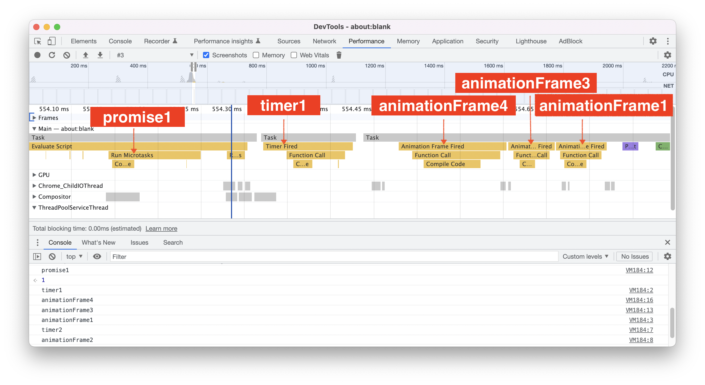
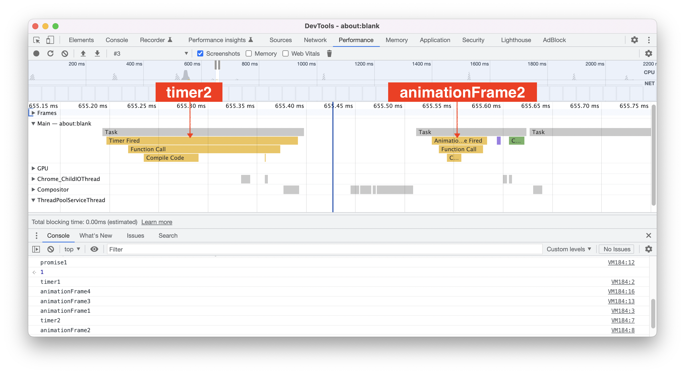
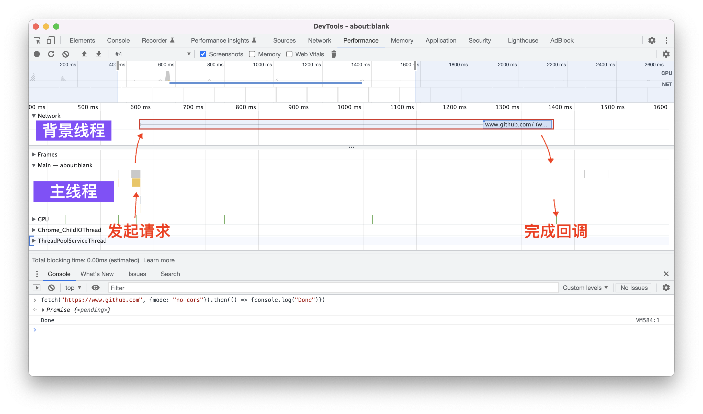

# 事件循环：

在一个HTML页面中，会发生许多不同类型的任务，包括HTML解析、用户交互、脚本执行、页面渲染、资源请求等等，所有的这些任务，都会使用事件循环机制来协调。


<br/>


### 目录:

- [事件循环机制的组成](#事件循环机制的组成)

- [事件循环的运行过程](#事件循环的运行过程)

- [事件循环与背景线程](#事件循环与背景线程)
<br/>


## 事件循环机制的组成

每一个HTML页面都至少关联着一个事件循环机制。一个事件循环机制的主要组成部分包括：

- 多个不同的类型的「任务队列」。
- 一个「微任务队列」。

每一个任务队列包含一系列的任务，这些任务普遍被大家称为「宏任务」，与「微任务」相对。值得注意的是，虽然名为“任务队列”，但它的数据结构并不是队列，而是sets，所以它并不遵循“先进先出”的原则。在事件循环机制运行时，会选择队列中的「第一个可运行的任务」而不是“第一个任务”来执行。

为了合理安排任务的优先级，事件循环机制有[不同类型的队列](https://html.spec.whatwg.org/multipage/webappapis.html#generic-task-sources)，至少有以下几种：

- 与DOM操作相关的任务队列：主要的任务类型是对DOM操作的反应。比如，在下面的img标签中，当改变视口的大小超过临界点时，一个更新img内容(src)与尺寸的宏任务会进入这个队列：

  ```html
  
  ```

- 与用户交互相关的任务队列：主要的任务类型是对用户交互的反应。比如，在下面的button标签中，当用户点击的时候，回调函数`fire()`会进入到这个队列当中：

  ```html
  <button onclick="fire()">按钮</button>
  ```

- 与网络资源相关的任务队列：主要的任务类型是对网络请求的返回内容进行处理；比如，加载下面的标签时，会添加一个请求任务进入该队列：

  ```html
  <link rel="stylesheet" href="main.css">
  ```

- 与导航相关的任务队列：主要的任务类型是页面导航以及历史导航。

- 与定时器相关的任务队列：包括处理`setTimeout `、`setInterval`的回调。

浏览器通过给不同队列不同的执行优先级，使得一些重要的任务（如用户的点击事件）获得更快的响应。

<br />

而微任务队列包含的任务类型包括：Promise、Mutation Observer的任务，每一个宏任务执行完后都会先执行微任务队列中的任务。


<br/>


## 事件循环的运行过程

事件循环会持续不断地运行[以下过程](https://html.spec.whatwg.org/multipage/webappapis.html#event-loop-processing-model)：

1. 根据一定的规则选择一条任务队列，并执行队列中第一个可执行的任务；
2. 依次执行微任务队列中的所有任务；
3. 更新视图。

<br />

前面两点在上一节其实已经讲得很清楚了，而**更新视图是另一个很重要、但是却鲜有人提及的地方。** 

更新视图的过程主要包含以下两个步骤：

1. **检查是否需要更新视图。** 以下的情况可能会导致浏览器认为页面不需要更新：
   - 硬件限制：如果页面支持的帧率是60HZ，如果当前时间与上一次更新视图操作的时间间隔过短（远小于16.7ms）的时候，浏览器可能会放弃这次更新；
   - 页面不可见：当`document.visibilityState`为`hidden `的时；如窗口最小化、或页面在后台标签页运行时；
   - 没有更新的必要：浏览器认为更新页面没有视觉效果，且等待执行的animatioFrame回调为空。
   
2. **对需要更新视图的页面**：会做许多事情：
   - 根据条件触发相应的事件，比如
     - 如果视口的宽、高有改变，在window对象上触发`resize`事件；
     - 如果文档或元素由滚动，分别在document或元素上触发`scroll`事件；
     - ......
   - 如果此时animationFrame队列不为空，依次触发animationFrame队列中的回调。

基于以上，当页面在后台标签页运行的时候，由于视图不会更新，所以requestAnimationFrame的回调也不会被触发。所以，当下面的代码在前台标签页与后台标签页运行时，他们的打印顺序是不一样的：

```js
requestAnimationFrame(()=>{console.log('a')})
setTimeout(() => {console.log('b')}, 100)

// 前台标签页运行时：
a
b

// 后台标签页运行且时间超过100毫秒：
b
a
```

<br />

我们可以使用一个例子，把宏任务、微任务、视图更新的三个过程给理清楚了。在下面的这个例子中，我们用两个`setTimeout`注册两个定时器，时间分别是0ms以及100ms；两个定时器的回调函数逻辑都是打印定时器的标识并触发一个requestAnimationFrame。然后我们用`Promise.resolve()`注册一个promise，最后我们再直接调用一个requestAnimationFrame。在这里，两个定时器触发的是宏任务，promise触发的是微任务，而requestAnimationFrame的回调会在视图更新的时候触发。

```html
<script>
    setTimeout(function timer1(){
        console.log('timer1')
        requestAnimationFrame(function raf1(){console.log('animationFrame1')})
    }, 0)

    setTimeout(function timer2(){
        console.log('timer2')
        requestAnimationFrame(function raf2(){console.log('animationFrame2')})
    }, 100)

    Promise.resolve().then(function promise1(){
        console.log('promise1')
        requestAnimationFrame(function raf3(){console.log('animationFrame3')})
    })
    
    requestAnimationFrame(function raf4(){console.log('animationFrame4')})
</script>
```

这里的打印结果是：

```
promise1
timer1
animationFrame4
animaitonFrame3
animationFrame1
timer2
animationFrame2
```

以下是这个过程发生的事情：

1. 第一个宏任务：（Parse HTML）解析HTML：
   1. 执行代码：
      1. 把`timer1`、`timer2`添加到定时器任务队列中。
      2. 把`promise1`添加到微任务队列中。
      3. 把`raf4`添加到等到执行的animationFrame队列中。
      
      此时，三个队列如下：
      
      ```
      定时器任务队列：[timer1、timer2]
      微任务队列： [promise1]
      requestAnimation队列：[raf4]
      ```
      
   2. 由于微任务队列不为空，所以执行微任务队列中的微任务：
      1. **打印出promise1。** 
      2. 把`raf3`添加到等到执行的animationFrame队列中。
      
      此时，三个队列如下：
      
      ```
      定时器任务队列：[timer1、timer2]
      微任务队列： []
      requestAnimation队列：[raf4, raf3]
      ```

2. 第二个宏任务：（Timer Fired）定时器任务队列中，`timer1`处于可执行状态，取出`timer1`：

   1. 执行`timer1`：
      1. **打印"timer1"** 
      2. 把`raf1`添加到等到执行的animationFrame队列中。
   2. 微任务队列为空，不做操作。

   此时，三个队列如下：

   ```
   定时器任务队列：[timer2]
   微任务队列： []
   requestAnimation队列：[raf4, raf3, raf1]
   ```

3. 第三个宏任务：更新视图：
   1. 依次执行注册的animationFrame回调：
      1. **打印animationFrame4**
      2. **打印animationFrame3**
      3. **打印animationFrame1**

   此时，三个队列如下：

   ```
   定时器任务队列：[timer2]
   微任务队列： []
   requestAnimation队列：[]
   ```

4. 第四个宏任务：100毫秒后，（Timer Fired）定时器任务队列中，`timer2`处于可执行状态，取出`timer2`：
   1. 执行`timer2`:
      1. **打印"timer2"** 
      2. 把`raf2`添加到等到执行的animationFrame队列中。
   2. 微任务队列为空，不做操作。

   此时，三个队列如下：

   ```
   定时器任务队列：[]
   微任务队列： []
   requestAnimation队列：[raf2]
   ```

5. 第五个宏任务：更新视图：
   1. 依次执行注册的animationFrame回调：
      1. **打印animationFrame2**

   此时，三个队列都为空：

   ```
   定时器任务队列：[]
   微任务队列： []
   requestAnimation队列：[]
   ```

你可以通过chrome开发者工具的performance tab看到这个过程：



100毫秒后：



**这里需要的注意的是**，假如有其他的逻辑进行干扰，使得timer1任务的执行在首次更新视图后才执行，那么打印的顺序会变成这样：

```
promise1
animationFrame4
animaitonFrame3
timer1
animationFrame1
timer2
animationFrame2
```


<br/>


## 事件循环与背景线程

事件循环在页面的主线程内工作。一个典型的异步执行的任务，会由主线程与至少一条背景线程共同完成，具体步骤如下：

> 1. 在主线程（事件循环）中执行一些初始化的工作，有可能需要把一些js的值转化为可供背景线程操作的数据。
> 1. 在背景线程中执行任务，背景线程无法访问主线程中的js环境，任务执行的结果的结果也不能直接在js环境中使用。
> 1. 在事件循环的特定队列中添加一个任务，在任务中会把背景线程的结果转化为可在宿主环境中运行的js类型的值。
>

比如，使用`fetch()`方法异步获取资源的时候，会有以下的过程：

> 1. 在主线程中，根据`fetch()`的调用收集准备发起的请求的参数。
> 2. 根据参数，在网络进程中发起实际的请求，等待返回结果。
> 3. 在事件循环的网络资源队列中添加一个任务，该任务会把返回的结果转化为js对象，并执行fetch方法注册的相关回调。
>

比如下面的代码：

```js
fetch("https://www.github.com", {mode: "no-cors"}).then(() => {console.log("Done")})
```

你可以在开发者工具的performance tab中看到这个过程：



在这张图里，你还可以看到其他的线程：

- GPU：GPU线程，用于生成图片。
- Compositor：合成线程。
- Chrome_ChildIOThread：IO线程，用于接受用户输入事件、网络事件、设备相关等事件。

除此以外，你还可以使用worker线程。worker创建的线程也称为「worker事件循环」，机制与主页面的事件循环一样，只不过[worker的任务队列](https://html.spec.whatwg.org/multipage/workers.html#worker-event-loop)中，没有与DOM操作相关的任务，只有事件、回调、网络资源相关的任务。

